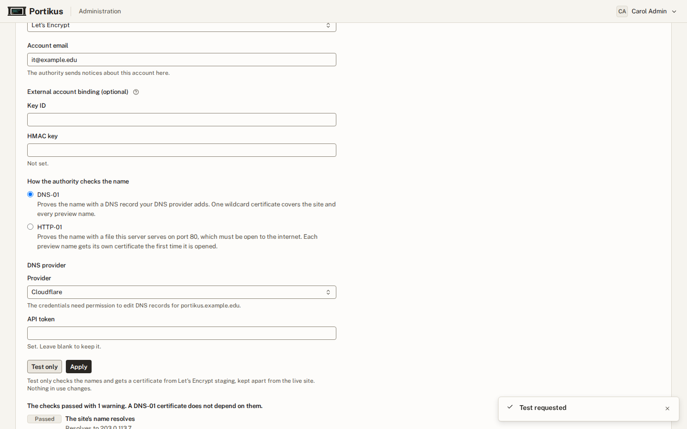

# Administrator guide

This guide is for the people who run Portikus for a course or a department:
administrators, and a short section at the end for instructors. It covers
the tasks that come up during a term. Installing and upgrading the platform
itself is in [OPERATIONS.md](OPERATIONS.md).

Portikus has the same help built in. Each administration tab starts with a
short **About** note. You can fold it away, and this browser remembers
that. The note's **More in Help** link opens the matching topic of
**For administrators**, the administrator help, in a new tab. It sits under
the administration tabs at `/admin/help`, and only administrators can open
it. **Help** in the menu under your name opens it too while you are on an
administration tab; anywhere else it opens **Using your workspace**, the
help students and instructors see. Each of the two pages links to the
other. A
small **?** button beside a label explains that one item in a sentence or
two; press Escape to close it.


## Find a person and their workspace

You land on **Administration** when you sign in. From your own workspace,
open it from the menu under your name. The **Users** tab lists everyone who
has signed in. Search by name, email, username or workspace label, and
choose a name to open its panel. The panel shows the workspace's state and
storage, and every action for it.


**Add user…**, above the table, creates an account with a Portikus
password. You give the person the first password privately; it is shown
once, and they choose their own when they first sign in.

## When a student says their workspace is broken

1. Open their panel. If it shows **Error**, read the message.
   **Re-provision** creates the workspace again and keeps their home folder.
2. If it is **Throttled**, it used a lot of CPU for a long time. **Lift
   throttle** gives full speed back.
3. If Docker is stuck or full, **Reset Docker** deletes every Docker image,
   container and volume in the workspace. Projects and home stay.
4. **Rebuild workspace** recreates the workspace from the current image.
   Projects and home stay, and Docker data too unless you untick it.
   Packages installed with `sudo apt` do not.

## Storage and limits

**Edit quotas** grows the home or Docker allocation. Sizes can only grow.
**Edit limits** sets the most CPU, memory and processes one workspace may
use; a blank field uses the site value.

## The resource guard

Portikus slows a workspace that keeps its CPUs busy for a long time, and
flags one that uses a lot of memory. A memory flag slows nothing. Set the
thresholds on **Settings**, and change them for one workspace with **Guard
settings** in its panel. Throttled and flagged workspaces are listed on
**Health**.

## When workspaces stop

A workspace keeps running for the **disconnect grace period** after its last
browser tab closes. With no input for the **idle stop** time, the student is
asked "Still working?", and the workspace stops five minutes later unless
they answer. Both are set on **Settings** and can be changed for one
workspace from its panel.

A student can choose **Keep running** in their workspace dialog, for
example to leave a coding agent working overnight. Until the time they
pick, neither the grace period nor idle stop counts; afterwards both start
again, with the "Still working?" warning first. Resource guard limits still
apply. **Longest keep running (hours)** on **Settings**, default 12, caps
how far ahead a student can hold their workspace, and 0 turns the feature
off. It limits how far ahead a hold reaches, not how often it is renewed.
Lowering it shortens holds already set at the next worker pass. **Guard
settings** in a workspace's panel sets it for that workspace. While a
student's hold lasts, the workspace's resource guard summary shows "Kept
running by its owner until …".


**Settings** holds the site-wide rules: when workspaces stop, how heavy use
is slowed, and the acceptable-use statement. Saving a new statement asks
everyone, you included, to accept it before they continue. Most rules can be
changed for one workspace from its panel on **Users**.

## Internet access

**Network** chooses between two modes. Open mode allows every public site
except the ones you block. Allow-list mode allows only the presets, hosts
and ranges you list. Private networks are always blocked, so a range you add
cannot overlap one.

Use **Test a host** to see why a name would be allowed or refused.
**Refused names** shows what workspaces tried and failed to reach over the
last 7 days, for the whole site, never per student.


## Docker images and the pull cache

Workspaces pull Docker Hub and ghcr.io images through a pull cache on the
server. The **Docker** tab shows its size and use, and **Clear cache**
empties it. The **Pull cache space** meter shows how full the cache is,
with a mark at 90 percent, where it empties itself. The **seed** is a set
of images that new workspaces and Reset Docker start with; the **Seed
size** meter shows its size on disk against its limit. A meter adds "nearly
full" and an alert icon near its limit, and "over the limit" past it.

Every image row shows a **Download size**: the compressed size for this
server, from what the cache already holds. A dash means the cache has never
held that image. The seed limit counts unpacked images, which are larger
than the download. **Image use** covers the last 120 days.

When there was not enough free space at setup, setup turns the pull cache
off, and the tab says so and why. **Clear cache** then does nothing. To turn
the cache back on, free space on the main disk and run
`sudo dpkg-reconfigure portikus`.

On a new install the seed list starts with the official slim Node and
Python images that match the default workspace image, such as
`node:24-slim` and `python:3.13-slim`. Press **Rebuild seed** to build it.
Portikus never changes a list you have set or emptied. After you make
another workspace image the default, or roll back, a notice under **Images
for the next rebuild** may say the image runs a different Node or Python
than the list holds, and which images it would replace or add. **Update
list and rebuild** does both and rebuilds the seed. If the new images
would pass the size limit, judged by download sizes, the notice offers no
button; raise **Largest seed**, or remove images, first.

The ghcr.io cache is on by default. Students build and push their images
in GitHub Actions, which runs on GitHub's machines and pushes to the real
ghcr.io with the repository's `GITHUB_TOKEN`; the cache does not touch that.
In a workspace they only pull those images, through the cache, with no
`docker login`. A minimal workflow:

```yaml
name: image
on: push
jobs:
  build:
    runs-on: ubuntu-latest
    permissions:
      contents: read
      packages: write
    steps:
      - uses: actions/checkout@v4
      - uses: docker/login-action@v3
        with:
          registry: ghcr.io
          username: ${{ github.actor }}
          password: ${{ secrets.GITHUB_TOKEN }}
      - uses: docker/build-push-action@v6
        with:
          push: true
          tags: ghcr.io/${{ github.repository }}:latest
```

The student then makes the package public on GitHub and runs
`docker pull ghcr.io/<owner>/<image>:<tag>`, or uses it in `FROM`. While the
cache is on, inside workspaces:

- `docker push` to ghcr.io does not work. Push from GitHub Actions instead.
- Private ghcr.io images cannot be pulled. Make the package public.
- `docker login ghcr.io` reports success without checking anything.
- Tools other than Docker, such as curl, `gh` and ORAS, get certificate
  errors for ghcr.io.

To turn it off, clear **Cache ghcr.io images** on the **Docker** tab. A
change reaches each workspace when it next starts.

Security: the ghcr.io cache uses a certificate authority made on the server
that may sign only `ghcr.io`. Its key is readable by root alone. Only Docker
inside workspaces trusts it; the workspace system, browsers and other tools
do not.

### What saves disk and what saves bandwidth

The pull cache saves download bandwidth, pull time and the shared Docker
Hub rate limit. It does not save disk: every student who pulls an image
still has a full unpacked copy in their own Docker storage. The cache adds
one fixed-size file on the server, sized by an install question (20 GiB by
default) and reserved when it is made. The first fetch of an image
downloads about twice its size, a quirk of the registry; later pulls
download almost nothing (measured: 88 MB, then 8 KB).

Seeds are what save disk. A seed image is stored once and shared,
copy-on-write, by every workspace made or reset from the seed, so it costs a
student only what they change. For example, four images of 2.9 GB shared by
30 students take 2.9 GB instead of about 87 GB. Use **Image use** to move
popular pulled images into the seed. Existing workspaces take a new seed
only when the student uses Reset Docker; Docker storage is never swapped
behind a student's back. The net disk cost of the cache is that one capped
file, which `sudo dpkg-reconfigure portikus` can size down.

## Workspace images

The **Image** tab lists the workspace images on this server. **Delete**
removes an image you no longer need and frees its disk space. The default
image is never deleted, and the previous image is kept so you can roll
back. Delete asks first, saying how many workspaces were made from the
image (they keep working) and how much space deleting frees. After each fetch or build, the server keeps the default, the
previous and the newest image on its own and deletes the rest.

**Image size (compressed)** is the size of the image file Incus stores.
Deleting an image frees about this much, or less. A dash, read as "Not
measured yet", means the next image job will measure it. The **Main disk
space** meter above the list shows space used, the total and space free,
and turns amber from 80 percent used.

## Backups and restores

Each night the platform database and every workspace's home and recovery
points are copied and encrypted, either by the server itself (a server
installed with apt) or by a separate backup host that runs the platform's
virtual machine. Docker data is not backed up, because Reset Docker and
Rebuild recreate it. Until backups report to this platform, the tab says
backups are not connected.

A restore needs the **restore key**, the private key that decrypts backups,
installed on the server or the backup host. The status at the top of the
tab says whether it is.

On a server that backs itself up, the **Backup key** section lets you
download that key. It shows "Backup key not yet downloaded" until you do.
Download it once, confirm, and keep the file off the server, for example in
a password manager: copies of the backups kept elsewhere cannot be restored
without it. **Upload backup key** is for rebuilding a lost server from such
a copy; replacing a different key asks first, because that key is then
gone. docs/INSTALL.md, "Rebuilding from an off-site backup", has the steps.


To restore someone's files:

1. Choose **Restore from backup** in their panel, or **Restore** beside a
   set on **Backups**. Their workspace must be running.
2. The files arrive in a new folder in their home, next to their current
   files. Nothing is overwritten.
3. If they need their whole home back, choose **Replace home** beside that
   restored copy. It swaps their whole home folder for the one in the same
   backup set, and you confirm by typing their workspace label. The
   workspace stops during the swap and starts again afterwards. Their
   previous home is kept, and listed under **Clean up** until you delete it.

**Clean up** also lists pre-change snapshots and pre-change database dumps.
The operator takes a snapshot by hand before a risky change, such as a
rebuild on a new image, and saves a database dump on the backup host before
each deploy. Nothing deletes them on its own; delete them once the change
checks out.

## The site certificate

The **Certificate** tab sets the HTTPS certificate browsers see for the
site and for student previews (`*.preview.<site>`). A fresh install uses
Caddy's internal certificate authority. Caddy is the web server in front
of Portikus, and a certificate authority is a service that signs
certificates. Browsers warn about the internal one until each computer
trusts its root certificate. Choose a trusted certificate here once the
site is up. The installer and later setup runs never change it.



### Before you start

Check these before you change anything:

- **A public DNS name for the site**, such as `portikus.example.edu`,
  that points at this server. A trusted authority checks this name from
  the internet.
- **A wildcard DNS name for previews**, `*.preview.portikus.example.edu`,
  pointing at the same server. Student previews live under it.
- **A way to prove you control the name.** Pick one:

| Method | Choose it when | What it needs |
|---|---|---|
| ACME with DNS-01 (recommended) | Your DNS is hosted by one of the nine providers below | An API token or key that can edit DNS records in the zone. Port 80 is not needed. |
| ACME with HTTP-01 | Your DNS provider is not on the list | Port 80 open from the internet to this server, and a small class (see "Rate limits") |
| Upload files | Your institution issues certificates for you | A certificate and key in PEM format that cover the site and the preview wildcard |
| Internal authority | A lab or private network with no public DNS | Every computer must install the root certificate |

ACME (Automatic Certificate Management Environment) is the protocol free
certificate services such as Let's Encrypt speak. DNS-01 and HTTP-01 are
its two ways of proving you control a name: with a temporary DNS record,
or with a file served on port 80.

**Firewall.** The site always needs its HTTPS port open. HTTP-01 also
needs inbound port 80 to reach this server, both for the first
certificate and for every renewal. DNS-01 needs only outbound HTTPS to
the authority and to the DNS provider.

### Read the status

**Certificates in use** shows the certificate for the site and for a
sample preview name: its source, issuer, the names it covers, when it
expires, and when Portikus last checked. A badge says **Expires soon**
within 14 days and **Expired** after the date. Below it, **Latest job**
shows the last change, test, renewal or roll back with its state
(**Waiting to start**, **Running**, **Succeeded**, **Failed** or
**Refused**) and its log.

### Walk-through: Let's Encrypt with DNS-01 and Cloudflare

This is the common case. Other providers differ only in the fields of
step 3.

1. **Create a Cloudflare API token.** In the Cloudflare dashboard, open
   My Profile, then API Tokens, then Create Token, and start from the
   "Edit zone DNS" template. Give it two permissions: Zone, DNS, Edit and
   Zone, Zone, Read. Under Zone Resources, include only the zone that
   holds the site's name. Copy the token; Cloudflare shows it once. Use
   an API token, not the older Global API Key.
2. **Open Admin, then Certificate.** Under **Change the certificate**,
   set **Source** to **ACME (Let's Encrypt and others)**.
3. **Fill the form.**
   - **ACME directory**: **Let's Encrypt**.
   - **Account email**: an address the authority can write to about
     problems, such as `it@example.edu`.
   - Leave **External account binding (optional)** empty.
   - **How the authority checks the name**: **DNS-01**.
   - **Provider**: **Cloudflare**, then paste the token into
     **API token**.
4. **Press Test only.** The pre-flight checks run first and show under
   the buttons. Then the job gets a certificate from Let's Encrypt
   staging, a test service whose certificates browsers do not trust,
   kept apart from the live site. Nothing in use changes. Watch the log
   under **Latest job**; a test usually takes under a minute, and the job
   gives up after five minutes.
5. **When the test shows Succeeded, press Apply** and confirm. The token
   you typed is now stored, so you can leave **API token** blank: the
   hint **Set. Leave blank to keep it.** means a value is saved.
6. **Check the result.** **Latest job** shows **Succeeded**, and
   **Certificates in use** names Let's Encrypt as the issuer, with the
   site and `*.preview.<site>` among the names. Reload the page; the
   browser no longer warns.

### DNS providers

Choose the provider that hosts the zone for the site's name. The hint
under **Provider** reminds you the credentials need permission to edit
DNS records for the site's name. Give each credential only that right,
and only on that zone. Fields marked secret are write-only.

| Provider | Fields on the page | Minimum credential |
|---|---|---|
| Cloudflare | **API token** (secret) | An API token with Zone, DNS, Edit and Zone, Zone, Read for this zone only. |
| Amazon Route 53 | **Region**, **Access key ID**, **Secret access key** (secret) | An IAM user whose policy allows `route53:ListHostedZonesByName`, `route53:ListResourceRecordSets`, `route53:ChangeResourceRecordSets` and `route53:GetChange`. Route 53 is global, so `us-east-1` works as the region. |
| DigitalOcean | **API token** (secret) | A personal access token that can write Domains. See the [caddy-dns/digitalocean README](https://github.com/caddy-dns/digitalocean). |
| OVH | **Endpoint**, **Application key**, **Application secret** (secret), **Consumer key** (secret) | An application and consumer key allowed `GET`, `POST`, `PUT` and `DELETE` on `/domain/zone/*`. The endpoint is your account's OVH region, such as `ovh-eu`. See the [caddy-dns/ovh README](https://github.com/caddy-dns/ovh). |
| Hetzner Cloud DNS | **API token** (secret) | A Hetzner API token that can edit the zone. See the [caddy-dns/hetzner README](https://github.com/caddy-dns/hetzner). |
| Gandi | **Personal access token** (secret) | A Gandi personal access token allowed to manage the domain's technical configuration. See the [caddy-dns/gandi README](https://github.com/caddy-dns/gandi). |
| Porkbun | **API key**, **Secret API key** (secret) | An API key pair, with API Access turned on for the domain in Porkbun's domain settings. |
| Google Cloud DNS | **Project ID**, **Service account key (JSON)** (secret) | A service account with the DNS Administrator role (`roles/dns.admin`) on the project, and its JSON key. Enter the key on one line. |
| Azure DNS | **Tenant ID**, **Client ID**, **Client secret** (secret), **Subscription ID**, **Resource group** | A service principal (an app registration) with the DNS Zone Contributor role on the zone or its resource group. |

If a provider's console does not offer what the table says, the provider
module documents it: each is the matching repository under
[github.com/caddy-dns](https://github.com/caddy-dns).

### ACME with HTTP-01

With **HTTP-01**, the authority fetches a file from this server on port
80, so port 80 must reach the server from the internet. HTTP-01 cannot
issue a wildcard, so each preview name gets its own certificate the first
time someone opens it, which makes that first visit a few seconds slower.

Portikus approves a preview certificate only for a port that is listening
in a running workspace, and at most 10 new preview names per workspace in
any hour (the count restarts when the API restarts). A preview link
opened before its port is listening, or past that limit, gets a browser
certificate error, such as `ERR_SSL_PROTOCOL_ERROR` in Chrome or "Secure
Connection Failed" in Firefox. Tell the student to wait until the program
is listening, then reload the page.

### Rate limits

Let's Encrypt limits how many certificates it issues. The ones that
matter here:

- **50 certificates per registered domain per week.** Under HTTP-01
  every preview name is its own certificate, so a busy class can run out,
  and new previews then fail until the week rolls on. DNS-01 needs one
  wildcard and avoids this.
- **5 duplicate certificates per week** for exactly the same set of
  names. Pressing Apply over and over to retry a failure uses these up.
- **5 failed validations per name per hour.** A wrong token or a closed
  port fails fast and counts.

That is why **Test only** comes first: Let's Encrypt staging has much
higher limits, so mistakes there cost nothing. ZeroSSL and custom
directories have no staging service, so **Test only** gets a real
certificate from them, which counts against their limits; it is still
kept apart and never put in use. The current limits are at
[letsencrypt.org/docs/rate-limits](https://letsencrypt.org/docs/rate-limits/).

### ZeroSSL, other authorities and EAB

Choose **ZeroSSL**, or **Another ACME directory** and fill in its
**Directory URL**. Some authorities, such as ZeroSSL or a campus
authority, need EAB (External Account Binding): a key ID and an HMAC key
that tie certificates to your account there. Fill in **Key ID** and
**HMAC key** under **External account binding (optional)**, exactly as
the authority gave them.

- **ZeroSSL**: sign in, open Developer, and choose Generate under "EAB
  Credentials for ACME Clients". The page shows the EAB KID (the key ID)
  and the EAB HMAC Key once.
- **Another authority**: its account or ACME page gives the directory
  URL, and the key ID and HMAC key if it uses EAB. Ask its administrators
  if you cannot find them.

A custom authority's certificates must be trusted by this server itself,
because Portikus calls its own address over HTTPS. If they are not, the
job refuses the change.

### Upload files

Choose **Upload files** under **Source**. Under **Site certificate**,
choose the **Certificate**, the **Private key** and, if the certificate
file does not already hold it, the **Intermediate chain (optional)**.

- Files are PEM text, which starts with `-----BEGIN`.
- The certificate file holds the server certificate first, then its
  intermediate certificates in order towards the root. Leave the root
  itself out.
- The private key must not have a passphrase.
- The certificate must name the site and `*.preview.<site>`. If it does
  not cover previews, tick **Use a separate wildcard certificate for
  previews** and fill in **Preview certificate** the same way.

Press **Check the certificate**. Portikus runs these checks on each
certificate and names the one that fails; a failed upload changes
nothing.

| Check | What failed | Fix |
|---|---|---|
| Certificate is readable | The file is not a PEM certificate | Export it again as PEM (Base64), not DER or PFX |
| Private key is readable | The key is missing, not PEM, or has a passphrase | Remove the passphrase, for example with `openssl pkey -in key.pem -out plain.pem` |
| Key matches the certificate | The key belongs to another certificate | Upload the key made with this certificate's request |
| Chain is complete | The certificate does not chain to a trusted root | Add the intermediates in order, or use **Intermediate chain (optional)** |
| Dates are valid | It is expired or not yet valid | Get a current certificate |
| Names cover the site | It does not name the site or the preview wildcard | Get one with both names, or add a separate preview certificate |

Then press **Apply**. Uploaded certificates do not renew. Portikus warns
you 14 days before expiry; upload new files before that date, or browsers
will refuse the site.

### Pre-flight checks

Before an ACME change, the tab runs these checks from the server itself:

| Check | Means |
|---|---|
| The site's name resolves | The site's name has a DNS address |
| Preview names resolve | A sample preview name has an address, so the `*.preview` wildcard record exists |
| The site's name reaches this server | Every address DNS gives for the site is this server |
| Preview names reach this server | The same for the sample preview name |
| Port 80 answers | `http://<site>` answers on port 80 (HTTP-01 only) |

Under HTTP-01 a failed check blocks the change. Under DNS-01 it is only a
**Warning**, because a DNS-01 certificate does not depend on these names;
you can still test and apply.

The checks have limits. They run from the server, so they cannot see a
firewall that only blocks outside traffic; the test certificate catches
that. On a server that uses systemd-resolved, an entry in `/etc/hosts`
counts as an answer, so a check can pass for a name the public DNS does
not have.

### What Test only and Apply do

Only one job runs at a time. While one waits or runs, the buttons are off
and say so. Each step appears in the log under **Latest job** as it
happens.

**Test only**:

1. Runs the pre-flight checks.
2. Starts a separate, temporary Caddy that asks the authority for a
   certificate (Let's Encrypt staging when Let's Encrypt is chosen).
3. Reports **Succeeded**, or **Failed** with what the authority or DNS
   provider said. The live site never changes.

**Apply**:

1. Runs the same test against the real directory, so the live site is
   untouched until a certificate is in hand. This gives up after five
   minutes; most runs take under a minute.
2. Switches the live site to the new settings and reloads Caddy.
3. Checks that the site and a preview name now serve the new
   certificate.
4. If that check fails, puts the old settings back on its own and says
   "The previous certificate is back in use." The site keeps working
   throughout.

Error messages never contain the secrets you typed.

### Troubleshooting

| The log or page says | Likely cause | Fix |
|---|---|---|
| "Cloudflare refused the token", HTTP 401 or 403, "invalid access token" or "authentication error" | The DNS credential is wrong, expired or lacks permission | Make a new credential with the rights in "DNS providers" and enter it |
| A pre-flight check "does not resolve in DNS" | The site or the `*.preview` wildcard record is missing | Add the record, then wait for DNS to update |
| "does not reach this server at every address DNS gives" | A record points elsewhere, often an old IPv6 address | Fix or remove the wrong record |
| "does not answer on port 80, which HTTP-01 needs", or an HTTP-01 test times out | Port 80 is closed in a firewall or not forwarded | Open inbound port 80 to the server, or use DNS-01 |
| `rateLimited` or "too many certificates" | A Let's Encrypt rate limit | Wait for the time the message names; test with staging meanwhile |
| `externalAccountRequired` | The authority needs EAB | Fill in **Key ID** and **HMAC key** |
| "failed the check" and a check name | An upload check failed | See the table in "Upload files" |
| "Caddy refused the new configuration; the log says why." | Caddy could not start with the new settings | Read the log line before it; the old settings stay in use |
| "Caddy did not serve the new certificate for ..." | The new certificate did not reach the live site | Portikus put the old one back; check DNS, then try again |
| "No certificate was obtained, and the live site is unchanged." | The authority did not issue | The text after "Caddy said:" names the reason |
| "this authority's certificates are not trusted by this server" | A custom authority's root is not installed on the server | Ask the server's operator to install it, or choose another authority |

### Renewal and notifications

Caddy renews an ACME certificate on its own, about 30 days before it
expires. Internal certificates last 12 hours and renew themselves.
Portikus notifies every administrator when the certificate expires within
14 days, and when a renewal fails ("A certificate did not renew").

**Renew now** asks for a fresh certificate from the same service, for
example after fixing the DNS token that made a renewal fail. It shows only
for ACME. Uploaded files are never renewed: upload new ones before they
expire.

### Roll back and reset

**Roll back** puts back the settings in use before the last change, with
their stored secrets, and the site reloads with their certificate. The
current settings become the previous ones, so you can roll forward again.
Only one earlier generation is kept.

If a change made the site unreachable so this tab cannot be opened, the
server's operator runs:

```
sudo portikus reset-certificate
```

That switches to the internal authority and keeps the replaced settings
as the previous generation (OPERATIONS.md, "The site certificate"). Open
the tab, trusting the internal root if the browser asks, fix the cause,
and press **Roll back** to return to those settings.

### Download the root certificate

**Download root certificate**, under **Internal root certificate**, gives
the internal authority's root. Browsers trust the site under the internal
authority only after it is installed:

- **Windows**: open the file, choose Install Certificate, then Local
  Machine, and place it in Trusted Root Certification Authorities.
- **macOS**: open the file to add it to the System keychain, then open it
  in Keychain Access and set Trust to Always Trust.
- **Linux**: copy it to `/usr/local/share/ca-certificates/` with a `.crt`
  name and run `sudo update-ca-certificates`.
- **Firefox** keeps its own list: Settings, Privacy and Security, View
  Certificates, Authorities, Import, then tick "Trust this CA to identify
  websites".
- **iPhone and iPad**: open the file in Safari and allow the download,
  install the profile in Settings, General, VPN and Device Management,
  then turn it on in Settings, General, About, Certificate Trust
  Settings.
- **Android**: Settings, Security, Encryption and credentials, Install a
  certificate, CA certificate, then choose the file. Menu names vary by
  maker.
- **ChromeOS**: Settings, Privacy and security, Security, Manage
  certificates, Authorities, Import, then tick "Trust this certificate
  for identifying websites".

Keep the root on administrators' computers even after a switch to ACME,
because the reset command falls back to it.

### Security notes

- Secret fields (DNS tokens and keys, the HMAC key, an uploaded private
  key) are write-only. Afterwards the page shows only **Set. Leave blank
  to keep it.** or **Not set.** A blank field keeps the stored value;
  nobody can read a secret back through the page.
- The secrets live only on the server, in
  `/etc/portikus/certificate/secrets/`, readable by root and Caddy. They
  never appear in Caddy's saved configuration, a log, the audit log or an
  error message.
- The audit log records `certificate.job_requested` when an administrator
  starts a test, change, renewal or roll back, and
  `certificate.job_finished` with its result. It records who and what,
  never a secret.
- Give each DNS credential the least access that works, and revoke the
  old one after you replace it.

## Users: search and paging

The **Users** tab shows 50 people at a time. Search, the filters and the sort
run on the server, so they cover everyone, not just the page you see. A line
above the table says "Showing 50 of 312". **Next** and **Previous** move
between pages. Choosing a filter or typing a search goes back to the first
page. Bulk actions apply only to the rows you ticked on the page you are on.

## Link accounts for someone else

A person may have an SSO account and a course account (from a learning
system) and need both to open the same workspace. Normally they link the two
themselves. When they cannot, open the person's panel on **Users**. Under
**Linked course accounts**, choose to link a course account, search for it,
pick it and confirm. Portikus applies the same checks as when a person links
their own accounts, and refuses what they would refuse.

**Unlink** next to a linked account takes the link away. It works for any link,
even when the SSO account has since been disabled. Both actions are written to
the audit log with you as the actor, and the holder of the SSO account gets a
notification.

## The agent log

If a workspace misbehaves in a way its state does not explain, open its panel
on **Users** and read the **Agent log**. It shows the workspace agent's own
recent warnings and errors. The agent keeps them only in memory inside the
workspace, so a restart clears them, and the workspace must be running. Only a
few fields are shown: time, level, message and a short list of safe details.
Treat the lines as hints. The owner of a workspace can change what the agent
reports, so they are not proof of anything.

## Sign-in

The **Sign-in** tab has two groups. The first is **Single sign-on**, which
chooses who vouches for your users. You can pick Microsoft Entra ID, Google
Workspace, another OpenID Connect provider, or "Dex passwords only", which
means accounts that have a Portikus password and no outside provider. The
fields for each provider are the same questions `dpkg-reconfigure portikus`
asks. A client secret is never shown again once saved: leave the box empty to
keep the stored one. If you change the tenant, issuer or client ID, you must
type a new secret, because Portikus will not send an old secret to a different
place.

If the server uses LDAP, the page shows that as read-only. LDAP is still
changed with `sudo dpkg-reconfigure portikus`. You can switch from LDAP to
another provider on the page.

A change is a **trial**:

1. Fill in the provider and choose **Apply as a trial**. Read the dialog:
   while a bad trial is open, students may not be able to sign in.
2. Wait while setup applies it, then choose **Test sign-in**. A new window
   takes you through the provider. A test never creates a user or a session.
   It reports whether the sign-in worked and which role the person would get.
3. When the test passes, choose **Keep**. For "Dex passwords only" there is
   nothing to test, so Keep is offered at once.
4. If you roll back, do nothing for 30 minutes, or setup fails, Portikus puts
   the old settings back.

The local administrator's Dex password always works, so you cannot lock
yourself out. Only one trial can be open at a time, and a trial cannot start
while another change is running. This works only on servers installed with
apt.

## LMS platforms

The second group on **Sign-in**, **Learning management systems**, registers the
learning systems (Canvas, Moodle and others) that may open Portikus through
LTI. Choose to add a platform and fill in the name, issuer, client ID, login
address, keyset address, an optional token address (needed for roster sync)
and the deployment IDs, one per line. Addresses must be HTTPS on the default
port. A platform whose issuer and client ID are already in the operator's file
(see [OPERATIONS.md](OPERATIONS.md), "The platforms file") is refused. You can
add up to 20. Platforms from the operator's file show read-only.

Saving restarts the API so it reads the new list. Root shells end and open
sockets reconnect, and the dialog warns you first. Portikus also lets the
servers behind the new addresses through the egress proxy, on port 443 only.
The registration steps inside the learning system are in
[OPERATIONS.md](OPERATIONS.md), "Signing in from a learning management
system".

## Allowed API hosts

On **Network**, the group **Allowed API hosts** lets workspaces reach a host on
the internet that the egress proxy would otherwise refuse, for example an AI
provider's API. Type a **Host name** and add it. Use host names only: no IP
addresses, ports or web addresses. Each host is allowed on port 443 for HTTPS
only. You can add up to 50. Hosts from the operator's own list show read-only,
and each host you added has a remove button.

## Site address

The **Site address** tab changes the host name and port people use to reach
Portikus. It is a guided switch, because a wrong address can make the site
unreachable.

1. **Plan.** Enter the **New host name** and **Port**. The page shows what
   will change: the site name, the preview names (`preview.<host>`, unless an
   operator set the suffix by hand, in which case it stays), and the
   certificate. A certificate from Caddy's internal authority or from ACME is
   renewed for the new name. Uploaded certificate files must already cover the
   new names, or the change is refused.
2. **Checks.** The page tests that the new names resolve in DNS, that they
   point at this server, and that port 80 answers. Fix DNS first when a check
   fails.
3. **Trial.** Choose **Apply as a trial**. Setup moves the site. Open the new
   address in a new tab. If you do nothing, Portikus puts the old address back
   after 15 minutes.
4. **Keep.** Sign in at the new address and choose **Keep** there. It must be
   pressed from the new address, which proves the address works for you.

Running workspaces keep their old preview names until they next start. The
page lists them, and nothing is restarted. If the new address stops working
after you chose Keep, the way back is `sudo dpkg-reconfigure portikus`, or
editing `portikus_public_port` in `/etc/portikus/portikus.yaml`; see
[OPERATIONS.md](OPERATIONS.md), "Changes made from the admin pages".

## Health, logs and audit

**Health** shows the host and the platform now and over time. Read it first
when many students report trouble.


**Logs** shows the platform's own error, warning, info and debug lines. They
never include students' files, commands or terminal output.


**Audit** records every sign-in and every change to accounts, workspaces and
settings, and who made it. Each action is named for its area and then the
event, such as `workspace.start_requested`. Type `workspace.` in **Action
starts with** to see every workspace action.


## Alerts

**Settings**, then **Notifications**, decides where Portikus sends
warnings and failures that need a person, such as a service stopping, a
backup failing or a certificate about to expire. Channels:

- **Email**, through your SMTP server on port 587 (STARTTLS) or 465
  (TLS). TLS is required. List up to ten recipients.
- **Pushover**, with your user key and application token.
- **ntfy**, with a topic URL on ntfy.sh or your own server, and an
  optional token.
- **Microsoft Teams**, with a Workflows webhook URL.
- **Webhook**, which also works for Slack, Mattermost, Google Chat and
  Discord (use Discord's URL ending in `/slack`).

Every URL must start with `https://` and use port 443. Passwords,
tokens and secret URLs are never shown again: each field says whether
one is set, and leaving it blank keeps it. Changing the SMTP server or
user name clears its password, and changing the ntfy host clears its
token, unless you enter a new one. Each save is audited and every
administrator gets a notice. The page shows when the change has been
applied. Then use the channel's own **Send test** button.

**Alert when a root shell opens** sends a warning to every channel each
time someone opens a root shell. It is off by default.

If the settings file on the server is damaged, the page shows every
channel as off with a notice; saving replaces the file.

## The root shell

The **Root shell** tab opens a root shell on the server. **Use it with
care: root can read every student's files and change anything.** The
tab is there only when the server's operator has left root shells on.

- Open several shells and split or drag panes as in a workspace.
- Nothing you type or see is recorded. Opening and closing each shell
  is audited, and the server's journal records it too.
- Closing a pane, reloading the page or leaving Administration ends its
  shell. There is no reconnect. A `tmux` you started keeps running;
  attach to it again with `tmux attach`.
- Signing out, losing the administrator role, or a disabled account
  ends every shell at once, and everything it left running, tmux
  included.
- An upgrade or anything else that restarts Portikus ends every root
  shell. **Run `apt upgrade` and other long jobs inside `tmux`.**
- Keys typed before the prompt appears are lost. A very large paste
  while the shell is busy may be dropped; the shell says so.

## Roles

Administrators and instructors come from your sign-in provider's groups, or
are granted in Portikus with **Promote** and **Make instructor**. Only
single sign-on (SSO) accounts can be granted a role in Portikus; course
accounts get theirs from the learning system. You can take away only a role
that was granted in Portikus, and you cannot demote yourself. Instructors
see a **Course** page for the courses they teach.

## What administrators cannot see

You see a workspace's CPU, memory, disk, port numbers and short process
names. You never see a student's files, terminals, commands or prompts, and
Portikus does not record them.

## For instructors: the Course page

Once you open Portikus from a course you teach in your learning system, a
**Course** link appears in the header of your workspace. It opens the
course's page in a new tab. The page lists everyone who has opened Portikus
from the course, with their role, last launch and workspace state.


**Remove** takes a student off the page. Their account, workspace and files
stay, and they come back if they open Portikus from the course again. Only
students can be removed; instructors are changed in your learning system.
