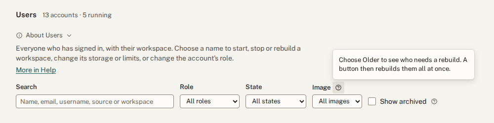
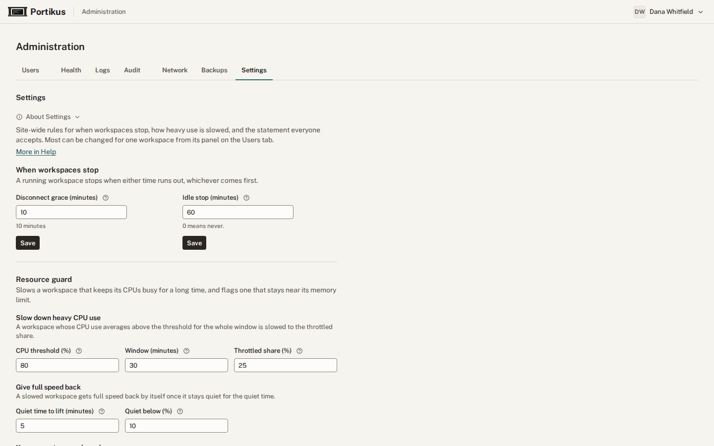
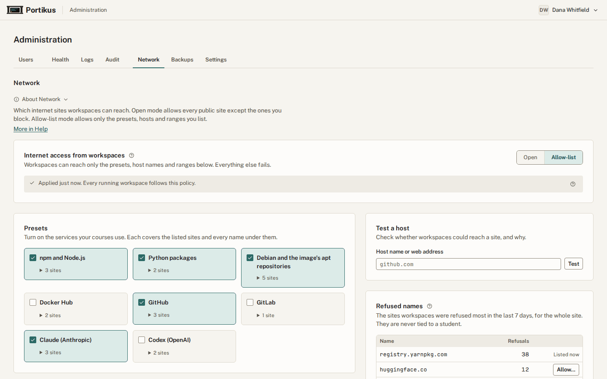
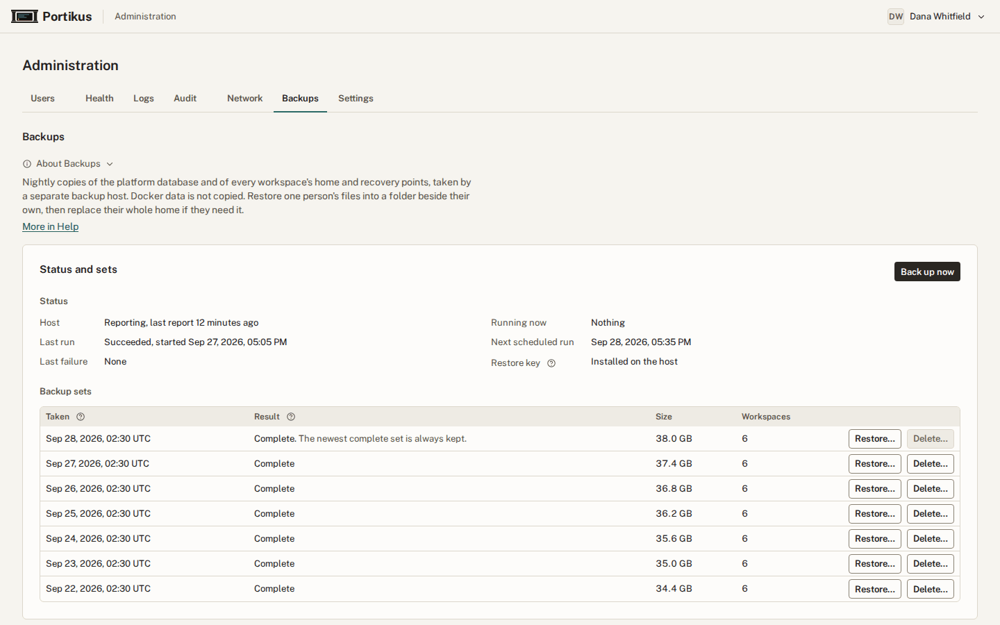
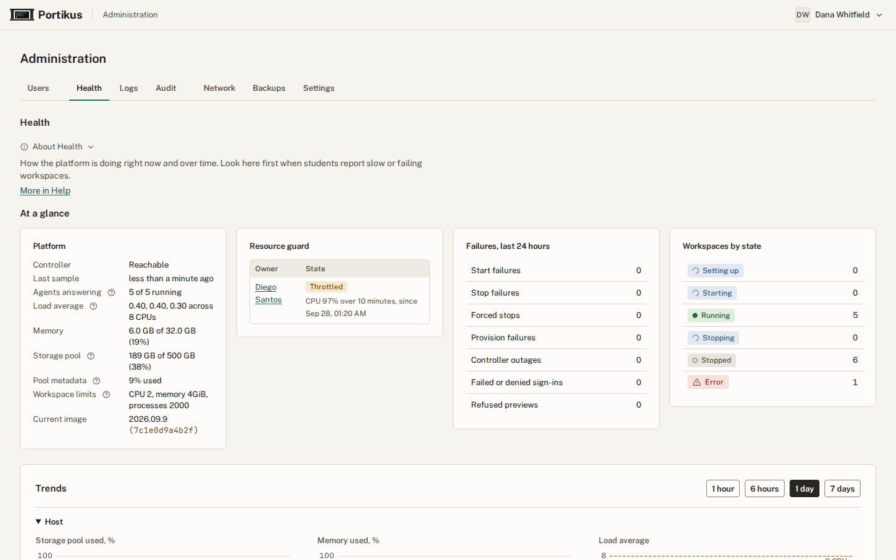
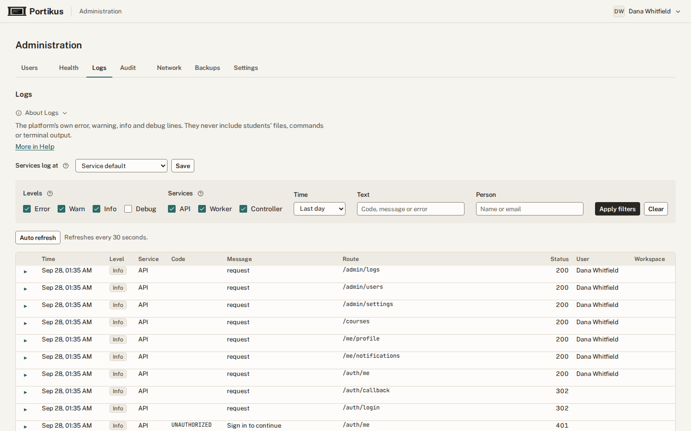
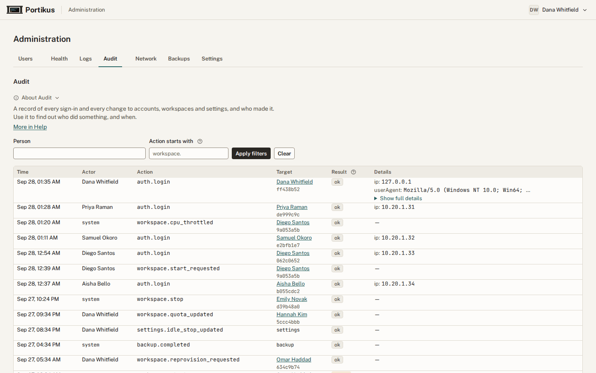
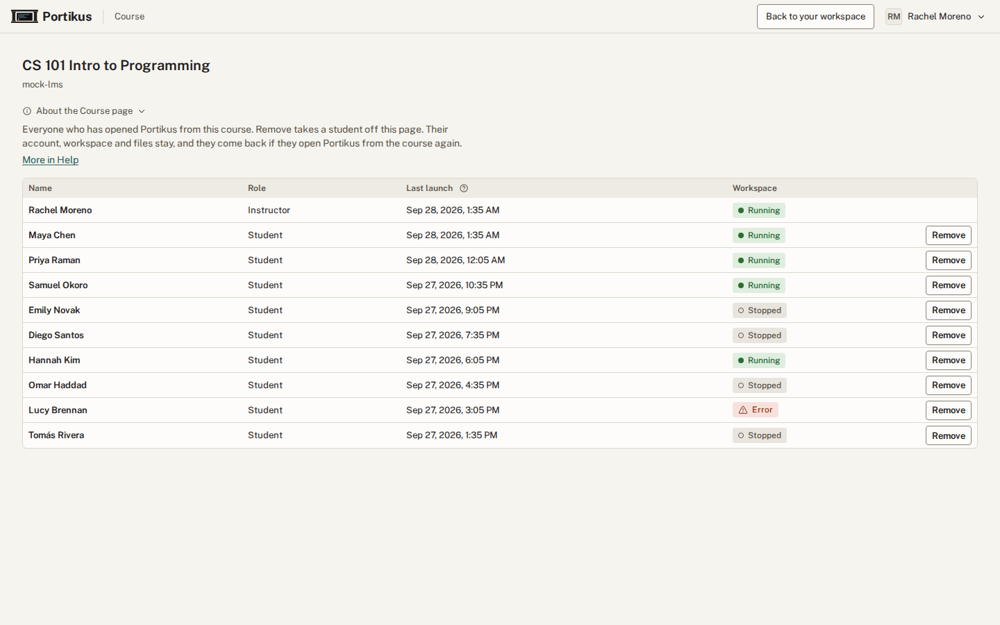

# Administrator guide

This guide is for the people who run Portikus for a course or a department:
administrators, and a short section at the end for instructors. It covers
the tasks that come up during a term. Installing and upgrading the platform
itself is in [OPERATIONS.md](OPERATIONS.md).

Portikus has the same help built in. Each administration tab starts with a
short **About** note. You can fold it away, and this browser remembers
that. The note's **More in Help** link opens the matching part of the
**Help** page in a new tab. Help is also in the menu under your name. A
small **?** button beside a label explains that one item in a sentence or
two; press Escape to close it.



## Find a person and their workspace

You land on **Administration** when you sign in. From your own workspace,
open it from the menu under your name. The **Users** tab lists everyone who
has signed in. Search by name, email, username or workspace label, and
choose a name to open its panel. The panel shows the workspace's state and
storage, and every action for it.


**Add user…**, above the table, creates an account with a Portikus
password. You give the person the first password privately; it is shown
once, and they choose their own when they first sign in.

## When a student says their workspace is broken

1. Open their panel. If it shows **Error**, read the message.
   **Re-provision** creates the workspace again and keeps their home folder.
2. If it is **Throttled**, it used a lot of CPU for a long time. **Lift
   throttle** gives full speed back.
3. If Docker is stuck or full, **Reset Docker** deletes every Docker image,
   container and volume in the workspace. Projects and home stay.
4. **Rebuild workspace** recreates the workspace from the current image.
   Projects and home stay, and Docker data too unless you untick it.
   Packages installed with `sudo apt` do not.

## Storage and limits

**Edit quotas** grows the home or Docker allocation. Sizes can only grow.
**Edit limits** sets the most CPU, memory and processes one workspace may
use; a blank field uses the site value.

## The resource guard

Portikus slows a workspace that keeps its CPUs busy for a long time, and
flags one that uses a lot of memory. A memory flag slows nothing. Set the
thresholds on **Settings**, and change them for one workspace with **Guard
settings** in its panel. Throttled and flagged workspaces are listed on
**Health**.

## When workspaces stop

A workspace keeps running for the **disconnect grace period** after its last
browser tab closes. With no input for the **idle stop** time, the student is
asked "Still working?", and the workspace stops five minutes later unless
they answer. Both are set on **Settings** and can be changed for one
workspace from its panel.



**Settings** holds the site-wide rules: when workspaces stop, how heavy use
is slowed, and the acceptable-use statement. Saving a new statement asks
everyone, you included, to accept it before they continue. Most rules can be
changed for one workspace from its panel on **Users**.

## Internet access

**Network** chooses between two modes. Open mode allows every public site
except the ones you block. Allow-list mode allows only the presets, hosts
and ranges you list. Private networks are always blocked, so a range you add
cannot overlap one.

Use **Test a host** to see why a name would be allowed or refused.
**Refused names** shows what workspaces tried and failed to reach over the
last 7 days, for the whole site, never per student.



## Docker images and the pull cache

Workspaces pull Docker Hub and ghcr.io images through a pull cache on the
server. The **Docker** tab shows its size and use, and **Clear cache**
empties it. The **seed** is a set of images that new workspaces and Reset
Docker start with.

The ghcr.io cache is on by default. Students build and push their images
in GitHub Actions, which runs on GitHub's machines and pushes to the real
ghcr.io with the repository's `GITHUB_TOKEN`; the cache does not touch that.
In a workspace they only pull those images, through the cache, with no
`docker login`. A minimal workflow:

```yaml
name: image
on: push
jobs:
  build:
    runs-on: ubuntu-latest
    permissions:
      contents: read
      packages: write
    steps:
      - uses: actions/checkout@v4
      - uses: docker/login-action@v3
        with:
          registry: ghcr.io
          username: ${{ github.actor }}
          password: ${{ secrets.GITHUB_TOKEN }}
      - uses: docker/build-push-action@v6
        with:
          push: true
          tags: ghcr.io/${{ github.repository }}:latest
```

The student then makes the package public on GitHub and runs
`docker pull ghcr.io/<owner>/<image>:<tag>`, or uses it in `FROM`. While the
cache is on, inside workspaces:

- `docker push` to ghcr.io does not work. Push from GitHub Actions instead.
- Private ghcr.io images cannot be pulled. Make the package public.
- `docker login ghcr.io` reports success without checking anything.
- Tools other than Docker, such as curl, `gh` and ORAS, get certificate
  errors for ghcr.io.

To turn it off, clear **Cache ghcr.io images** on the **Docker** tab. A
change reaches each workspace when it next starts.

Security: the ghcr.io cache uses a certificate authority made on the server
that may sign only `ghcr.io`. Its key is readable by root alone. Only Docker
inside workspaces trusts it; the workspace system, browsers and other tools
do not.

### What saves disk and what saves bandwidth

The pull cache saves download bandwidth, pull time and the shared Docker
Hub rate limit. It does not save disk: every student who pulls an image
still has a full unpacked copy in their own Docker storage. The cache adds
one fixed-size file on the server, sized by an install question (20 GiB by
default) and reserved when it is made. The first fetch of an image
downloads about twice its size, a quirk of the registry; later pulls
download almost nothing (measured: 88 MB, then 8 KB).

Seeds are what save disk. A seed image is stored once and shared,
copy-on-write, by every workspace made or reset from the seed, so it costs a
student only what they change. For example, four images of 2.9 GB shared by
30 students take 2.9 GB instead of about 87 GB. Use **Image use** to move
popular pulled images into the seed. Existing workspaces take a new seed
only when the student uses Reset Docker; Docker storage is never swapped
behind a student's back. The net disk cost of the cache is that one capped
file, which `sudo dpkg-reconfigure portikus` can size down.

## Backups and restores

Each night the platform database and every workspace's home and recovery
points are copied and encrypted, either by the server itself (a server
installed with apt) or by a separate backup host that runs the platform's
virtual machine. Docker data is not backed up, because Reset Docker and
Rebuild recreate it. Until backups report to this platform, the tab says
backups are not connected.

A restore needs the **restore key**, the private key that decrypts backups,
installed on the server or the backup host. The status at the top of the
tab says whether it is.

On a server that backs itself up, the **Backup key** section lets you
download that key. It shows "Backup key not yet downloaded" until you do.
Download it once, confirm, and keep the file off the server, for example in
a password manager: copies of the backups kept elsewhere cannot be restored
without it. **Upload backup key** is for rebuilding a lost server from such
a copy; replacing a different key asks first, because that key is then
gone. docs/INSTALL.md, "Rebuilding from an off-site backup", has the steps.



To restore someone's files:

1. Choose **Restore from backup** in their panel, or **Restore** beside a
   set on **Backups**. Their workspace must be running.
2. The files arrive in a new folder in their home, next to their current
   files. Nothing is overwritten.
3. If they need their whole home back, choose **Replace home** beside that
   restored copy. It swaps their whole home folder for the one in the same
   backup set, and you confirm by typing their workspace label. The
   workspace stops during the swap and starts again afterwards. Their
   previous home is kept, and listed under **Clean up** until you delete it.

**Clean up** also lists pre-change snapshots and pre-change database dumps.
The operator takes a snapshot by hand before a risky change, such as a
rebuild on a new image, and saves a database dump on the backup host before
each deploy. Nothing deletes them on its own; delete them once the change
checks out.

## The site certificate

The **Certificate** tab sets the HTTPS certificate browsers see for the
site and for student previews (`*.preview.<site>`). A fresh install uses
Portikus's own certificate authority, which browsers warn about until
they trust its root certificate. Choose a real certificate here once the
site is up. The installer and later setup runs never change it.

### Read the status

The top of the tab shows the certificate in use: where it comes from, who
issued it, the names it covers, and when it expires, for the site and for
a sample preview name. It also says whether the last renewal worked.
Portikus sends every administrator a notification when the certificate
expires within 14 days or a renewal fails.

### Choose a source

- **Portikus's own authority.** No setup, but every browser must trust
  its root certificate ("Download the root certificate", below). Good for
  a lab or a private network.
- **ACME.** ACME (Automatic Certificate Management Environment) is the
  protocol free certificate services speak. Choose Let's Encrypt, Let's
  Encrypt's staging service (for trying things out; browsers do not trust
  it), ZeroSSL, or any other service by its directory URL. Give an email
  the service can write to about problems. Caddy, the web server in front
  of Portikus, renews the certificate on its own.
- **Upload files.** Use a certificate you already have, for example from
  your institution.

### ACME: prove you control the name

Pick one way:

- **DNS-01** (recommended). Portikus adds a temporary DNS record to prove
  control, so it can get one wildcard certificate for every preview
  address and does not need port 80. Choose your DNS provider (Cloudflare,
  Route 53, DigitalOcean, OVH, Hetzner, Gandi, Porkbun, Google Cloud DNS
  or Azure) and fill in its fields. Give the provider's token only the
  right to edit DNS records in this zone.
- **HTTP-01 with on-demand previews.** The service fetches a file from the
  server on port 80, so port 80 must reach the server from the internet.
  It cannot issue a wildcard, so each preview address gets its own
  certificate the first time someone opens it, which makes that first
  visit slower. Let's Encrypt allows 50 certificates per domain per week,
  so a busy class can run out; use DNS-01 when you can.

Some services, such as ZeroSSL or a campus authority, need **EAB**
(External Account Binding): a key ID and an HMAC key from the service's
account page that tie the certificate to your account. Fill in both when
the service asks for them.

Secret fields (tokens, the HMAC key, a private key) are write-only. The
tab shows only whether each is set. Leave one blank when you apply again
to keep the stored value.

### Upload files

Upload the certificate in PEM format with its intermediate certificates
after it, and its private key without a passphrase. The certificate must
cover the site's name and `*.preview.<site>`. If your site certificate does
not cover previews, upload a separate preview wildcard certificate and key
as well. Portikus checks that each key matches its certificate, that the
chain is complete, that the dates are valid and that the names cover the
site and previews. If a check fails, the tab names it and changes
nothing.

### Test, then apply

Before an ACME change, the tab checks that the site and a sample preview
name point at this server, and for HTTP-01 that port 80 answers. For
HTTP-01 a failed check stops the change; for DNS-01 it is a warning. The
check runs from the server itself, so it cannot see a firewall that only
blocks outside traffic; the test below catches that.

- **Test only** runs the check and gets a test certificate without
  touching the live site. For Let's Encrypt it uses Let's Encrypt's
  staging service. ZeroSSL and custom services have no staging service,
  so the test gets a real certificate from that service, which counts
  against its limits.
- **Apply** runs the same test, then switches the live site. If the new
  certificate does not appear in time, Portikus puts the old one back on
  its own and shows the error, with any secret removed. The site keeps
  working throughout.

The tab shows each step while it runs. Only one change runs at a time.

### Renew and roll back

- **Renew now** asks for a fresh certificate from the same service, for
  example after fixing a DNS token that made a renewal fail.
- **Roll back** returns to the settings in use before the last change,
  with their secrets. Only one earlier generation is kept.

If a change made the site unreachable so this tab cannot be opened, the
server's operator runs `sudo portikus reset-certificate`
(OPERATIONS.md, "The site certificate"). That switches to Portikus's own
authority; then Roll back here returns to the settings it replaced.

### Download the root certificate

**Download root certificate** gives Portikus's internal root certificate.
Browsers trust the site under the internal authority only after it is
installed:

- **Windows**: open the file, choose Install Certificate, Local Machine,
  and place it in Trusted Root Certification Authorities.
- **macOS**: open it in Keychain Access, add it to the System keychain,
  and set it to Always Trust.
- **Linux**: copy it to `/usr/local/share/ca-certificates/` with a `.crt`
  name and run `sudo update-ca-certificates`. Firefox keeps its own list:
  Settings, Privacy & Security, View Certificates, Authorities, Import.

The root also stays useful after a switch to ACME, because the reset
command falls back to it.

## Health, logs and audit

**Health** shows the host and the platform now and over time. Read it first
when many students report trouble.



**Logs** shows the platform's own error, warning, info and debug lines. They
never include students' files, commands or terminal output.



**Audit** records every sign-in and every change to accounts, workspaces and
settings, and who made it. Each action is named for its area and then the
event, such as `workspace.start_requested`. Type `workspace.` in **Action
starts with** to see every workspace action.



## Roles

Administrators and instructors come from your sign-in provider's groups, or
are granted in Portikus with **Promote** and **Make instructor**. Only
single sign-on (SSO) accounts can be granted a role in Portikus; course
accounts get theirs from the learning system. You can take away only a role
that was granted in Portikus, and you cannot demote yourself. Instructors
see a **Course** page for the courses they teach.

## What administrators cannot see

You see a workspace's CPU, memory, disk, port numbers and short process
names. You never see a student's files, terminals, commands or prompts, and
Portikus does not record them.

## For instructors: the Course page

Once you open Portikus from a course you teach in your learning system, a
**Course** link appears in the header of your workspace. It opens the
course's page in a new tab. The page lists everyone who has opened Portikus
from the course, with their role, last launch and workspace state.



**Remove** takes a student off the page. Their account, workspace and files
stay, and they come back if they open Portikus from the course again. Only
students can be removed; instructors are changed in your learning system.
