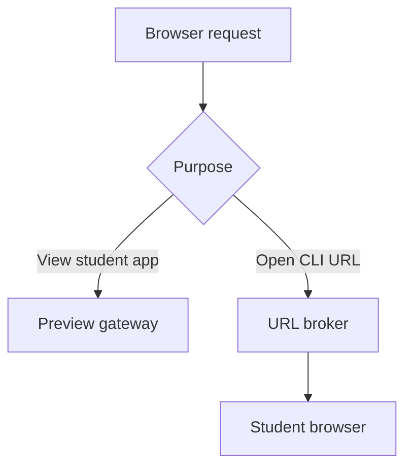

# Portikus Browser Handling Specification

**Status:** Design specification  
**Audience:** Software-development agents and human implementers  
**Related documents:** `SPEC.md`, `STACK.md`  
**Priority:** Application preview is P0 (Epic 8); URL brokering and provider-aware authentication are P0 (Epic 9). A remote-browser fallback is not planned; see `BACKLOG.md`, "Remote browser for loopback OAuth callbacks".

## 1. Purpose and authority

This document defines how Portikus handles two different browser problems:

1. displaying a web application running inside a student workspace; and
2. responding when a command-line tool in that remote workspace wants to open a browser, especially for authentication.

The two cases must not be implemented as one generic remote-desktop feature. Application previews use the student's existing browser and an authenticated reverse proxy. CLI browser requests use the student's browser through a URL broker. Portikus runs no browser on the server. A flow that can only finish by calling back to the workspace's own loopback interface is unsupported; both P0 coding agents have an out-of-band login path, and `BACKLOG.md` records the remote-browser idea should a required tool ever lack one.

This document refines the preview and coding-agent requirements in `SPEC.md` and the Caddy, Fastify, TypeScript, and workspace-agent choices in `STACK.md`. Where those documents contain a less specific browser-handling example, this document controls. It does not change their broader product or infrastructure decisions.

## 2. Design decisions

The implementation must follow these decisions unless a later architecture decision record explicitly replaces one.

| Area | Decision |
| --- | --- |
| Student application preview | Authenticated hostname-based HTTP/WebSocket proxy rendered in an iframe or separate browser tab |
| Rendering location | The student's browser; no server-side browser is involved |
| Preview routing | One origin per workspace/port using a wildcard preview namespace, named by the workspace label from `SPEC.md` Epic 8 |
| Edge | Caddy terminates TLS, performs an authorization subrequest, and carries preview traffic |
| Control plane | Fastify issues preview grants and answers authorization questions; it does not carry arbitrary student application bodies |
| Main session cookie | Host-only `__Host-` cookie on the exact Portikus application hostname |
| Preview authorization | Short-lived, single-use bootstrap ticket exchanged for a host-only preview session cookie that lives as long as the main Portikus session |
| Same-domain deployment | Supported baseline using `portikus.school.edu` and `*.preview.portikus.school.edu` |
| Separate preview domain | Preferred higher-isolation option, with partitioned-cookie/browser-compatibility work described below |
| CLI URL requests | `BROWSER`/`xdg-open` shim sends an `open-url` event to the Portikus UI |
| Loopback-only services | The workspace agent forwards an approved port from the container interface to `127.0.0.1`, so students need not change bind addresses |
| Authentication order | Provider-supported device/out-of-band flow, then external browser, then institutional credentials; no server-side browser |
| Remote browser, full desktop, VNC | Out of scope (`BACKLOG.md`) |

## 3. Goals

The browser subsystem must:

- let a student interact with a running application using normal clicks, hover behavior, forms, JavaScript, storage, streaming responses, and WebSockets;
- require no SSH tunnel, local port-forwarding tool, locally installed IDE, or desktop agent;
- keep untrusted student JavaScript outside the trusted Portikus origin;
- authenticate every preview request and WebSocket upgrade;
- prevent one student from reaching another student's services;
- convert terminal URLs such as `http://localhost:5173` into authorized preview actions;
- let remote CLI tools ask the Portikus UI to open an HTTPS URL in the student's browser;
- favor device-code or other out-of-band authentication for headless coding-agent logins;
- keep credentials, authorization URLs, callback parameters, and cookies out of ordinary logs;
- remain portable across institutional deployments that control only a namespace beneath an existing `.edu` domain.

## 4. Non-goals

P0 does not provide:

- a remotely displayed Linux desktop;
- general VNC/noVNC service;
- a public deployment URL for student applications;
- arbitrary TCP forwarding to the student's computer;
- transparent rewriting of every hard-coded `localhost` URL found in JavaScript or HTML;
- browser DevTools for the preview iframe;
- credential entry or MFA automation;
- a general web-browsing service inside the workspace;
- a server-side browser of any kind (see `BACKLOG.md`);
- silent bypass of a student application's `frame-ancestors` or `X-Frame-Options` policy.

## 5. Terminology

**Portikus origin**  
The trusted application origin, for example `https://portikus.school.edu`.

**Preview origin**  
An origin assigned to one workspace and one target port, for example `https://tw7-5173.preview.portikus.school.edu`.

**Preview gateway**  
The Caddy-facing data plane that validates preview sessions and forwards HTTP and WebSocket traffic to an approved workspace target.

**Preview grant**  
A short-lived authorization record for a user, workspace, port, and preview host.

**Bootstrap ticket**  
A single-use, short-lived bearer value used only to establish a preview-host session. It is not a general Portikus session token.

**URL broker**  
The workspace-agent and UI path that turns a request such as `xdg-open https://...` into a user-visible action in the student's own browser.

**External browser**  
The student's ordinary local browser, outside the remote workspace.

**Loopback forward**  
A listener the workspace agent opens on the container's workspace-reachable interface that forwards to `127.0.0.1:<port>` inside the same container, so a service bound only to loopback is reachable by the preview gateway.

## 6. Browser subsystem overview



The two execution paths share typed contracts, authorization, auditing, and UI conventions. They do not share cookies or data-plane processes.

# Part I — Student application preview

## 7. Required deployment shapes

### 7.1 Same-site institutional deployment

This is the required baseline because many institutions can create DNS records beneath an existing domain but will not purchase or delegate another registrable domain.

```text
Portikus UI:        portikus.school.edu
Preview wildcard:  *.preview.portikus.school.edu
Example preview:   tw7-5173.preview.portikus.school.edu
```

The deployment requires:

- a dedicated Portikus hostname;
- wildcard DNS for the preview namespace, resolving only to the preview ingress;
- a wildcard TLS certificate for the preview namespace, or an equivalent automated certificate arrangement;
- an explicit configured preview suffix; and
- host-only Portikus cookies.

These hosts are different origins but the same browser site. Same-origin policy protects DOM, local storage, IndexedDB, and service-worker boundaries. `SameSite` cookies do not create a security boundary between them because the hosts are still same-site.

### 7.2 Separate registrable preview domain

This is the preferred higher-isolation deployment when an institution can provide it.

```text
Portikus UI:        portikus.school.edu
Preview wildcard:  *.portikus-preview.net
```

It reduces related-domain risks, including parent-domain cookie planting and same-site request behavior. It also makes the embedded preview cross-site, which creates a browser-storage complication: ordinary preview cookies may be blocked as third-party cookies.

Cross-site deployments must use a tested partitioned-cookie strategy for embedded previews:

```http
Set-Cookie: __Host-portikus-preview=<opaque>;
            Secure;
            HttpOnly;
            SameSite=None;
            Partitioned;
            Path=/
```

Top-level preview tabs may use an unpartitioned host-only cookie. The embedded and top-level cases may therefore need separate preview sessions. Portikus must run browser-compatibility tests before declaring this mode supported in a release. If a supported browser cannot establish the embedded partitioned session, Portikus must offer **Open in new tab** rather than weakening origin isolation.

### 7.3 Prohibited deployment shape

Student applications must not be mounted below the trusted application host as paths:

```text
https://portikus.school.edu/preview/workspace/port/
```

Cookie `Path` is not a security boundary, and student scripts served from the same origin would inherit the trusted origin. Path-prefix proxying also breaks applications that assume they are mounted at `/`.

## 8. Hostname format and routing identity

Use one DNS label per preview origin so a conventional wildcard certificate covers it:

```text
<workspace-label>-<port>.<preview-suffix>
```

Example:

```text
tw7-5173.preview.portikus.school.edu
```

The workspace label is the one `SPEC.md` Epic 8 defines: derived once, at workspace creation, from the identity provider's `preferred_username`, lowercased and reduced to a DNS label, stored on the workspace row, and pushed into the container as its hostname. Students see the same name in their shell prompt and in their preview URLs. The label may itself contain hyphens, so the parser takes the port from the text after the last hyphen.

Requirements:

- the workspace label is a routing name only; it identifies which workspace row to look up and is never evidence that the requester may reach it;
- the label parser must be strict and reject extra labels, Unicode ambiguity, invalid ports, overflow, signs, and alternate numeric forms;
- a syntactically valid hostname is never sufficient authorization;
- the gateway must resolve the label through the control plane to a currently valid workspace and approved target;
- the requested port must be an integer in the configured preview range and normally `1024-65535`;
- reserved workspace-agent, SSH, database, Docker, control, and management ports must be denied even if listening;
- DNS must not expose or encode internal IP addresses; and
- the gateway must never accept an upstream IP, hostname, or port directly from a query parameter or request header.

The preview host stays stable for the workspace/port pair for the life of the workspace, so browser storage and development sessions behave predictably. Deleting and recreating a workspace keeps the same label; the preview sessions of the old workspace are revoked with it.

## 9. Preview request flow

```mermaid
sequenceDiagram
    participant UI as Portikus UI
    participant API as Fastify API
    participant Edge as Caddy
    participant App as Workspace app
    UI->>API: Request preview grant
    API-->>UI: Host + single-use bootstrap ticket
    UI->>Edge: Navigate iframe to bootstrap URL
    Edge->>API: Consume ticket
    API-->>Edge: Approved preview session
    Edge-->>UI: Set host-only preview cookie; redirect to /
    UI->>Edge: Request app with preview cookie
    Edge->>API: Authorization subrequest
    API-->>Edge: Approved internal target
    Edge->>App: Proxy HTTP/WebSocket
```

### 9.1 Grant creation

The UI requests a grant from the trusted Portikus API:

```http
POST /api/workspaces/{workspaceId}/preview-grants
Content-Type: application/json
X-CSRF-Token: ...

{
  "port": 5173,
  "presentation": "embedded"
}
```

The API must:

1. authenticate the Portikus session;
2. enforce CSRF and exact trusted-origin checks;
3. authorize the user for the workspace;
4. verify that the workspace is running;
5. validate the port against policy;
6. optionally verify current listener discovery state;
7. calculate the expected preview hostname server-side;
8. create a single-use bootstrap ticket with a default lifetime no longer than 30 seconds; and
9. return the complete preview URL and expiry.

Suggested response:

```json
{
  "previewOrigin": "https://tw7-5173.preview.portikus.school.edu",
  "bootstrapUrl": "https://tw7-5173.preview.portikus.school.edu/__portikus/bootstrap?t=<opaque>",
  "expiresAt": "2026-09-19T20:15:30Z"
}
```

The bootstrap ticket must be random, stored hashed if persisted, bound to the authenticated user, workspace, port, exact preview host, and presentation mode, and invalid after first successful use. It must not be a self-contained copy of the main session cookie.

The ticket appears briefly in a URL, so the bootstrap endpoint must set `Referrer-Policy: no-referrer`, return `Cache-Control: no-store`, consume the ticket before redirecting, and ensure edge/application access logs omit the query string. No page content or external subresource may be served before the redirect removes the ticket.

### 9.2 Preview session

After consuming a bootstrap ticket, set a random preview-host session cookie:

```http
Set-Cookie: __Host-portikus-preview=<opaque>;
            Secure;
            HttpOnly;
            SameSite=Strict;
            Path=/
```

For a separate registrable preview domain embedded in Portikus, use the partitioned form described in section 7.2.

The preview session must:

- be valid only for the exact preview host;
- be bound server-side to user, workspace, port, presentation context, and the main Portikus session that created it;
- live as long as that main session: it ends when the main session expires, is logged out, or is revoked, and it is not renewed on its own schedule;
- stop working immediately when the user loses workspace authorization;
- stop working when the workspace is deleted or its preview identity rotates;
- be re-established through a fresh bootstrap from the trusted Portikus UI after the main session is renewed, without exposing the main session;
- be revocable independently of the main Portikus session (reset preview data, workspace deletion); and
- contain no username, internal address, or provider token.

### 9.3 Main Portikus session cookie

The main Portikus session must use a host-only cookie on the exact application host:

```http
Set-Cookie: __Host-portikus-session=<opaque>;
            Secure;
            HttpOnly;
            SameSite=Lax;
            Path=/
```

There must be no `Domain` attribute. No Portikus authentication cookie may be scoped to `.school.edu`, `.portikus.school.edu`, the preview suffix, or another parent domain.

The `__Host-` prefix protects the session name from being recreated as a parent-domain cookie by preview content. Same-site preview hosts can still attempt parent-domain cookie planting under other names and may create cookie-jar pressure. These are residual risks of a shared registrable domain and must be covered by threat-model documentation and tests. A separate registrable preview domain remains the stronger deployment.

## 10. Edge authorization and proxy data plane

Caddy should own TLS, browser-facing HTTP, WebSocket forwarding, streaming, and response delivery. Fastify should answer authorization and target-resolution questions.

Conceptual request path:

```text
Browser
  → Caddy preview virtual host
  → authorization subrequest to Fastify
  → resolved internal workspace target
  → Caddy reverse proxy
  → workspace service
```

The authorization response may return a trusted internal routing identifier or internal upstream selected from a server-side registry. Caddy must not construct an upstream from unchecked request text.

Every HTTP request and WebSocket upgrade must be authorized. Authorization must verify:

- preview session validity;
- exact requested host;
- user/workspace association;
- target port association;
- current account and enrollment policy;
- workspace state; and
- target compliance with deny rules.

The authorization endpoint must be reachable only from the edge/service network. It must not accept a client-supplied identity header as proof of authentication.

The data plane must support:

- HTTP/1.1;
- WebSocket upgrades;
- streaming responses and server-sent events;
- development-server HMR;
- request bodies large enough for ordinary coursework, under configurable limits;
- long requests under a configurable development timeout; and
- backpressure without buffering an entire response in the control plane.

## 11. Reaching services inside the workspace

### 11.1 P0 reachability rule

Caddy runs on the platform VM and can reach only services bound to a workspace-reachable interface, but Vite, Next, Flask, Django, and most other development servers bind to `127.0.0.1` by default. Students are not asked to change that. The workspace agent already runs inside the container on an authenticated channel, so when the control plane approves a preview for a port that is listening only on loopback, the agent opens a loopback forward: a listener on the workspace-reachable interface that copies bytes to and from `127.0.0.1:<port>`. The gateway targets that forward exactly as it would target a directly reachable service.

The loopback forward must:

- be opened only on the control plane's instruction, for a port that passed the same allow/deny policy as any other preview target;
- forward to `127.0.0.1` on the same port in the same container and nothing else; it is not a general TCP proxy;
- be reported to the control plane so the gateway's registry, not the agent, decides what Caddy may reach;
- close when the preview grant, the workspace, or the loopback listener goes away; and
- be invisible to the student except as the preview working.

Services already bound to `0.0.0.0` or the workspace interface are reached directly. Do not route preview bodies through the Fastify control-plane process to solve loopback reachability.

Listener discovery must record at least:

```ts
type ListeningService = {
  workspaceId: string;
  port: number;
  addresses: string[];
  protocolHint: "http" | "https" | "unknown";
  process?: { pid?: number; command?: string };
  container?: { id?: string; name?: string };
  previewReachability: "reachable" | "forwarded" | "denied" | "unknown";
  observedAt: string;
};
```

`forwarded` means the service is loopback-only and a loopback forward is open for it. If a forward cannot be opened (the port is denied, or the agent cannot bind the interface), the UI must not simply fail; it explains what happened and offers the next action.

### 11.2 What the forward is not

The forward is not a relay to other hosts, other containers, or other ports, and it does not carry traffic in the other direction. A student process cannot ask the control plane for one; only the control plane's registry decides what the gateway may reach. (The agent runs as the student and its token is readable by that user, so a student can open a forward on their own container's interface directly; it reaches only the platform VM and grants nothing the student does not already have. Recorded as a residual in STATUS.md.)

## 12. Preview UI behavior

The center pane must provide a Preview tab with:

- current preview URL or workspace/port label;
- reload;
- back/forward where the iframe history model permits it;
- open in separate tab;
- copy preview URL, with a warning that the URL still requires authorization;
- viewport size controls useful for responsive testing;
- current state: connecting, available, inactive, unauthorized, blocked from embedding, or error;
- a direct link to the Running surface; and
- reset preview data.

The iframe is a normal interactive browser frame. It must accept pointer, keyboard, focus, form, and hover interaction.

Recommended baseline iframe policy:

```html
<iframe
  sandbox="allow-scripts allow-same-origin allow-forms allow-modals allow-popups allow-downloads allow-pointer-lock"
  referrerpolicy="no-referrer"
  allow="clipboard-read 'none'; clipboard-write 'self'; camera 'none'; microphone 'none'; geolocation 'none'"
/>
```

The exact sandbox and Permissions Policy must be compatibility-tested. Do not add `allow-top-navigation` or broad device permissions by default. Because the preview is on a different origin, `allow-same-origin` preserves ordinary application storage and cookie behavior without granting access to the Portikus DOM.

If the student application sends `X-Frame-Options` or a CSP `frame-ancestors` directive that blocks embedding, Portikus must preserve the application's policy and offer **Open in new tab**. It must not silently strip security headers in the default mode.

The Portikus page cannot detect that refusal for itself: Chromium fires the frame's `load` event even for a navigation it refused, and a parent may not read a cross-origin frame's response headers. So the control plane asks on the student's behalf. `GET /workspaces/{id}/preview/embeddable?port=N` sends one `HEAD /` to the application (falling back to `GET /` with the body discarded if HEAD is refused, with a three-second timeout) and answers `{ embeddable, reason? }`, where `reason` is `x-frame-options`, `frame-ancestors` or `unreachable`. `DENY` and `SAMEORIGIN` both count as refusals, because the preview host is never the Portikus origin, and a `frame-ancestors` list counts as a refusal unless it names the Portikus origin or `*`. A refusal puts the tab straight into the blocked state with **Open in new tab**; an unreachable application keeps the eight-second load timeout, which remains the fallback.

This is the one place where the control plane speaks HTTP to a student application. The address probed comes from the workspace row and the listening registry, exactly as `/preview/authorize` takes it, never from anything the request carries, so the caller chooses a workspace and a port and never a host: server-side request forgery is not possible here. Only the two framing headers are read, and no part of the application's body is read or returned.

Reserved edge paths beginning with `/__portikus/` must be handled before proxying and must never reach the student application. They include at least bootstrap, health/error rendering, cross-port routing, and reset-preview-data functions. That precedence holds at the edge, but a service worker the application registered at the root of the preview origin can answer a navigation the frame makes before the request leaves the browser. Reset preview data is therefore driven from the Portikus page, which no such worker controls, rather than by navigating the frame.

## 13. Header and URL behavior

The gateway must set conventional forwarded metadata:

```text
X-Forwarded-Proto
X-Forwarded-Host
X-Forwarded-For
```

It must strip client-supplied copies before setting trusted values.

Default behavior should preserve the public preview host as `Host`. Some development servers validate `Host` or WebSocket `Origin`; Portikus templates must configure the exact preview suffix safely. Do not solve host validation by globally disabling it in all workspaces.

Compatibility behavior may rewrite only these narrowly defined cases:

- an absolute `Location` header pointing to `localhost`, `127.0.0.1`, or the workspace-internal address on the same mapped port may be rewritten to the current preview origin;
- a `Set-Cookie` domain that exactly names `localhost` or the workspace-internal host may be removed so the cookie becomes host-only on the preview origin; and
- WebSocket forwarding must preserve the external request path and query.

Do not rewrite arbitrary HTML, JavaScript, CSS, JSON, external redirects, OAuth redirect URIs, or application-generated URLs. Content rewriting is brittle, changes the application being tested, and can create security flaws.

## 14. Multi-port applications

JavaScript rendered on the student's computer interprets `localhost` as the student's computer. Therefore this code is not portable through the preview gateway:

```js
fetch("http://localhost:8000/api/users")
```

Portikus must support three deliberate patterns:

1. **Preferred:** the frontend uses relative URLs such as `/api`, and its development server proxies those requests to the backend inside the workspace.
2. **Same-origin Portikus bridge:** the frontend uses `/__portikus/ports/8000/api/users`; the edge authorizes the second port, strips the reserved prefix, and proxies it within the same workspace.
3. **Sibling preview origin:** the application uses the API port's preview origin and configures CORS intentionally.

The same-origin bridge must:

- remain inside the current workspace;
- validate the target port through the same allow/deny policy;
- authorize each request and WebSocket upgrade;
- reserve its namespace at the edge;
- make no arbitrary host or protocol selectable by the application; and
- return an understandable inactive-port response.

Templates may receive generated environment variables such as:

```text
PORTIKUS_PREVIEW=true
PORTIKUS_PREVIEW_ORIGIN=https://tw7-5173.preview.portikus.school.edu
PORTIKUS_PORT_BRIDGE_PREFIX=/__portikus/ports
```

Do not inject long-lived credentials into these values.

Two of these are provided today: the workspace controller writes
`/etc/profile.d/portikus.sh` into the container on every start, so every
login shell exports `PORTIKUS_PREVIEW=true` and
`PORTIKUS_PREVIEW_HOST_SUFFIX=<suffix>` (issue #263).

## 15. Terminal URL detection

The terminal linkifier must recognize URLs whose host is exactly:

- `localhost`;
- `127.0.0.1`;
- `[::1]`; or
- a workspace-local hostname explicitly reported by the workspace agent.

For eligible HTTP/HTTPS ports, clicking the link requests a preview grant and opens a Preview tab. It must not mechanically substitute strings in terminal output with a privileged URL.

The parser must reject:

- user-info syntax such as `localhost@evil.example`;
- suffix tricks such as `localhost.evil.example`;
- invalid or denied ports;
- non-HTTP schemes for preview handling; and
- URLs that resolve to platform management endpoints.

## 16. Preview security requirements

### 16.1 Portikus API protection

Because preview hosts can be same-site with Portikus, the main API must not rely on `SameSite` cookies as its CSRF defense. State-changing requests must require:

- a valid Portikus session;
- a valid CSRF token tied to that session; and
- an exact allowed `Origin`, normally the Portikus application origin.

Requests whose `Origin` is a preview origin must be rejected for privileged APIs. CORS must never grant `*.school.edu` or the preview wildcard general access to the Portikus API.

### 16.2 Browser isolation

Student preview code must be treated as hostile. It must not receive:

- the main Portikus session cookie;
- institutional OIDC tokens;
- preview routing secrets for another workspace;
- workspace-agent credentials;
- control-plane internal headers; or
- API responses through permissive CORS.

### 16.3 Network isolation

The preview gateway may target only registered workspace services. It must not reach:

- the host or hypervisor;
- Incus control interfaces;
- cloud metadata endpoints;
- the control-plane database;
- another workspace;
- arbitrary private addresses; or
- an address supplied by student content.

### 16.4 Service workers and stored state

Service workers are scoped to the preview origin. Edge-owned `/__portikus/` paths must take precedence over the upstream, even if a service worker exists. A worker whose scope covers the origin can still answer requests made by pages it controls, the preview frame among them, so Portikus must not rely on a frame navigation to reach a reserved path.

Reset preview data therefore runs in three steps from the Portikus page: revoke the workspace's preview sessions through the control plane, then fetch `/__portikus/reset` on the preview origin from the Portikus document, then take a fresh grant and bootstrap the frame again. The worker does not control the Portikus document, so that fetch reaches the edge.

What the reset answer clears, exactly:

- `Clear-Site-Data: "storage"` drops the preview origin's local storage, session storage, IndexedDB, cache storage and service worker registrations.
- A `Set-Cookie` expires the Portikus preview cookie for that origin.
- One further `Set-Cookie` per cookie name the request carried expires that name with `Path=/`, `Max-Age=0`, and `Secure` where the site is https. The fetch is made with credentials, so in the same-site deployment it carries the preview origin's cookies; Caddy strips only the Portikus preview cookie before the API sees the request, so what is left is the student application's own cookies. A cookie the application set on a narrower path, or for a parent domain, is not cleared: nothing in the request says which it was.

The `"cookies"` directive must never be sent: browsers apply it to the whole registrable domain, which in a same-site deployment the Portikus host shares with the preview hosts, so it would delete the student's Portikus session cookie and sign them out. The reset response is the same whether or not a preview cookie came with the request, so an unauthenticated caller can at most clear its own browser's data for that one origin.

### 16.5 Logging

Preview logs may include user ID, workspace ID, port, request method, normalized path class, status, byte counts, and timing. They must not include:

- bootstrap tickets;
- preview session cookies;
- query strings by default;
- request or response bodies;
- authorization headers;
- student application cookies; or
- full URLs known to contain provider authentication data.

## 17. Preview data model and contracts

Suggested persisted records:

```ts
type PreviewGrant = {
  id: string;
  userId: string;
  workspaceId: string;
  port: number;
  previewHost: string;
  presentation: "embedded" | "top-level";
  sessionId: string; // the main Portikus session the grant was issued in
  ticketHash: string;
  expiresAt: string;
  consumedAt?: string;
};

type PreviewSession = {
  id: string;
  tokenHash: string;
  userId: string;
  sessionId: string; // the main Portikus session it lives with
  workspaceId: string;
  port: number;
  previewHost: string;
  createdAt: string;
  revokedAt?: string;
};
```

The implementation may use signed opaque tokens instead of database lookup only if revocation, host binding, replay prevention, and secret rotation remain enforceable. Bootstrap tickets still require single-use state.

Suggested shared event:

```ts
type ListeningServicesChanged = {
  type: "workspace.listening-services.changed";
  workspaceId: string;
  services: ListeningService[];
  observedAt: string;
};
```

# Part II — CLI browser requests and authentication

## 18. URL broker

Programs in a remote workspace commonly attempt to open the default browser. Portikus must intercept the request rather than installing a desktop browser in every workspace.

The workspace image must provide a `portikus-open` command and arrange supported launch paths to use it:

```text
BROWSER=/usr/local/bin/portikus-open
```

The image should also provide an `xdg-open` integration or wrapper whose browser-URL behavior delegates to `portikus-open` while preserving documented non-URL behavior where needed. Do not assume every CLI honors `BROWSER`; test supported agents individually.

Flow:

```text
CLI process
  → portikus-open / xdg-open
  → workspace agent
  → authenticated control WebSocket
  → Portikus UI prompt
  → student opens the link in their own browser, copies it, or cancels
```

The shim sends the complete URL through the protected workspace-agent channel but does not print or log it beyond the terminal behavior of the invoking CLI.

Suggested contract:

```ts
type OpenUrlRequest = {
  type: "browser.open.request";
  requestId: string;
  workspaceId: string;
  terminalId?: string;
  url: string;
  source?: {
    executable?: string;
    pid?: number;
    cwd?: string;
  };
  requestedAt: string;
};

type OpenUrlDecision = {
  type: "browser.open.decision";
  requestId: string;
  decision: "external" | "copy" | "deny";
  decidedAt: string;
};
```

The UI must show:

- the destination origin prominently;
- the initiating terminal or executable when known;
- a warning if the URL is plain HTTP and not a loopback URL;
- **Open in my browser** as the normal action;
- **Copy link**; and
- **Cancel**.

Only `http:` and `https:` URLs may be brokered. Reject `javascript:`, `data:`, `file:`, custom schemes, embedded credentials, malformed hosts, control characters, and URLs exceeding a configured length. A loopback HTTP URL is converted into a preview action (section 15); it is never opened in the student's browser as is, because `localhost` there means the student's computer.

Browser popup blockers make silent tab creation unreliable and surprising. The UI should require a user click unless a direct user action in Portikus initiated the CLI launch and the browser permits the resulting navigation.

## 19. Authentication strategy

Use this order for coding-agent and developer-tool authentication:

1. provider-supported device-code or comparable out-of-band login;
2. external browser flow that does not depend on a callback to the workspace loopback interface;
3. API key, enterprise access token, or institution-provided credential mechanism when permitted by product and institutional policy (`SPEC.md` Epic 9, institutional credential injection);
4. fail with an explanation if the only remaining flow requires a callback to the workspace's loopback interface, an unsupported local authenticator, hardware key, file picker, download, or browser capability. Section 20 explains why that flow cannot be served without a server-side browser, and `BACKLOG.md` holds that option.

The provider adapter must decide among supported methods. Do not infer behavior solely by searching an authorization URL for the string `localhost`.

### 19.1 Codex

For remote/headless Codex CLI login, Portikus should prefer:

```bash
codex login --device-auth
```

The UI may recognize the device URL and make it easy to open, but the code remains visible in the terminal and the provider remains responsible for login. Device-code availability may depend on personal or workspace settings; Portikus must preserve the normal CLI error when it is disabled.

Codex also supports API-key login and, in eligible managed environments, access-token approaches. These belong to the credential policy, not the browser broker. Portikus must not copy a user's local `auth.json` into a workspace automatically.

### 19.2 Claude Code

Claude Code must be handled through an adapter based on its installed version and documented login behavior. Its browser login prints an authorization URL and accepts the resulting code pasted back into the terminal, which is an external-browser flow with no loopback callback and is the path the adapter selects; the API-key and institutional-credential paths remain available under credential policy. Portikus must not claim that Claude Code supports a Codex-style device command unless the installed version's official documentation and behavior establish it, and the adapter's behavior tests must be rerun when the pinned Claude Code version changes.

The URL broker remains useful even when the provider asks the user to copy a code back into the terminal.

### 19.3 Other tools

Additional CLI tools may define adapters with:

```ts
type BrowserAuthAdapter = {
  id: string;
  matchesProcess(command: string, argv: string[]): boolean;
  preferredModes(context: AuthContext): Array<"device" | "external" | "token">;
  buildLaunch?(context: AuthContext): CommandSpec;
  classifyOpenUrl?(url: URL): "device" | "external" | "loopback-required" | "unknown";
};
```

Unknown tools use the generic URL broker and require the student to choose. Provider-specific adapters must remain small and version-tested; the terminal system must not depend on undocumented agent internals.

## 20. Why external browsers cannot satisfy every loopback flow

If a CLI in the workspace listens on:

```text
http://127.0.0.1:43127/callback
```

and its registered OAuth redirect sends the browser to that URL, opening the authorization page in the student's computer causes `127.0.0.1` to refer to the student's computer, not the workspace.

Portikus cannot safely fix this by editing the OAuth `redirect_uri`; authorization servers validate registered redirects. It also cannot intercept the final navigation from a cross-origin page in the student's browser. An SSH tunnel or local desktop agent could bridge it, but both violate the browser-only Portikus requirement.

A browser running on the server whose loopback network is the workspace's network would close this gap, but it is the most expensive and security-sensitive piece considered for Portikus, and neither P0 coding agent needs it: Codex has device-code login and Claude Code accepts its code pasted back into the terminal. The idea, its isolation requirements, and its spike plan are recorded in `BACKLOG.md` under "Remote browser for loopback OAuth callbacks" and are not part of any epic. Until then such a flow fails with the explanation in section 19.

## 21. Browser handling security model

### 21.1 Threats

The implementation must account for:

- hostile student preview JavaScript attacking Portikus APIs;
- cross-user preview access;
- guessed or replayed preview grants;
- cookie tossing from a related preview subdomain;
- same-site CSRF;
- proxy SSRF into management networks;
- malicious terminal output creating deceptive links;
- a compromised CLI asking the user to open a phishing URL;
- authorization URLs containing bearer values in query or fragment;
- a loopback forward being turned into a general proxy; and
- login pages that require unsupported local authenticators or loopback callbacks.

### 21.2 User confirmation

An `open-url` event is a request, not permission. Portikus must show the destination origin and require a user decision. Provider adapters may improve the explanation but must not hide or replace the destination.

### 21.3 Secrets and telemetry

At all boundaries, redact URL query strings and fragments unless the protocol needs them in transit. Metrics should name the provider adapter and outcome, not the full URL. Errors shown to the student may include the public origin and a correlation ID but must not echo tokens.

## 22. Suggested service boundaries

The coding agent should preserve the repository conventions in `STACK.md`. A likely package/service split is:

```text
apps/web
  preview tab
  open-url prompt

apps/api
  preview-grant routes
  preview authorization endpoint
  open-url request coordination

apps/workspace-agent
  listening-service discovery
  loopback forwards
  portikus-open request transport

packages/contracts
  Zod schemas and TypeScript types, including the provider adapters'
  types; the Codex, Claude Code, and generic adapters live beside the
  launcher code in apps/ until a second consumer needs them

infra/ansible/roles/caddy
  wildcard preview routing
  bootstrap/reserved-path handling
  authorization subrequests

infra/ (workspace image)
  portikus-open
  BROWSER and xdg-open integration
```

`STACK.md` section 2 is the authority on layout. Shared Zod contracts are defined once and reused across browser, API, and workspace agent. No new package is added for this work.

## 23. Configuration

Browser behavior must be configuration-driven. Suggested settings:

```text
PORTIKUS_APP_ORIGIN
PORTIKUS_PREVIEW_SUFFIX
PORTIKUS_PREVIEW_SITE_MODE=same-site|cross-site
PORTIKUS_PREVIEW_PORT_MIN=1024
PORTIKUS_PREVIEW_PORT_MAX=65535
PORTIKUS_PREVIEW_DENIED_PORTS
PORTIKUS_PREVIEW_TICKET_TTL_SECONDS=30
```

The preview session has no lifetime setting of its own; it lives with the main session (section 9.2).

Production startup must fail if:

- application and preview hosts are identical;
- a cookie domain broadens the Portikus session;
- the preview suffix is missing or malformed;
- wildcard routing would accept the application hostname;
- management CIDR deny rules are absent.

## 24. Delivery phases

### Phase A — Preview architecture proof

Implement and prove:

- wildcard hostname routing;
- preview-grant bootstrap and host-only session;
- Caddy authorization subrequest;
- forwarding to one workspace service, both directly reachable and loopback-only through the agent's forward;
- WebSocket/HMR support;
- embedded and top-level preview;
- exact-origin/CSRF protection on Portikus APIs; and
- cross-user denial.

Do this before substantial Preview-tab polish.

### Phase B — Preview product completion

Add:

- listener discovery and Running surface integration;
- terminal linkification;
- inactive-port handling;
- multi-port bridge;
- reset preview data;
- header/redirect compatibility rules;
- browser test matrix; and
- same-site deployment threat-model tests.

### Phase C — URL broker and agent authentication

Add:

- `portikus-open` and `xdg-open` integration;
- typed workspace-agent event;
- user-confirmation UI;
- Codex device-auth launcher/profile;
- version-tested Claude Code adapter;
- URL validation and secret-safe logs; and
- documented key/token alternatives governed by credential policy.

Phases A and B are `SPEC.md` Epic 8; phase C is Epic 9. There is no remote-browser phase; see `BACKLOG.md`.

## 25. Acceptance criteria

### 25.1 Application preview

- A React/Vite application on port 5173 renders inside Portikus with click, hover, form, JavaScript, and HMR behavior intact.
- A WebSocket application remains connected through the preview gateway.
- Opening the preview in a separate tab works without making it public.
- A second student receives no application content, headers, or existence detail from the first student's preview host.
- Expired, replayed, wrong-host, wrong-port, and consumed bootstrap tickets fail closed.
- The Portikus main session cookie is absent from preview requests.
- Preview JavaScript cannot read Portikus DOM or storage.
- A state-changing Portikus API request initiated by preview code fails exact-origin/CSRF validation even though the preview may be same-site.
- Parent-domain cookie planting cannot replace the `__Host-portikus-session` cookie.
- Malformed hostnames and denied ports never produce an arbitrary upstream connection.
- `localhost.evil.example`, user-info URL tricks, encoded hostnames, and invalid numeric ports are not converted into previews.
- Vite or equivalent HMR succeeds through a supported host-validation configuration.
- An app bound only to loopback previews without any change to its bind address, through the agent's loopback forward, and the forward reaches nothing else.
- A preview session ends when the main Portikus session ends, and a fresh bootstrap restores it after login.
- The multi-port bridge reaches only another authorized port in the same workspace.
- An application that blocks framing is offered in a top-level tab without its security headers being silently removed.
- A stopped workspace or inactive service produces a Portikus-owned explanation, not a raw proxy error.
- Reset preview data clears supported stored state and establishes a fresh preview session.

### 25.2 URL broker

- A CLI honoring `BROWSER` creates one user-visible open request.
- A CLI invoking `xdg-open` creates the same request.
- HTTPS URLs open in the student's browser only after a user action.
- The prompt shows the true normalized destination origin.
- `javascript:`, `data:`, `file:`, embedded-credential, malformed, and overlong URLs are rejected.
- Query strings, fragments, codes, and tokens do not appear in application or audit logs.
- Duplicate requests are deduplicated by request ID and short time window.
- A request from an inactive or unauthorized workspace is rejected.
- `codex login --device-auth` can be completed entirely in the student's own browser when device authentication is enabled by the provider/workspace.
- Claude Code authentication follows the behavior verified for the installed version and does not rely on an invented device-flow command.
- A flow that requires a callback to the workspace loopback fails with an explanation and a recommendation, not a hang.

## 26. Required automated tests

At minimum, add:

- unit tests for hostname, URL, port, and origin parsing;
- property/fuzz tests for preview hostname and terminal URL parsers;
- authorization matrix tests covering user, workspace, port, host, session, and lifecycle state;
- CSRF and CORS tests from a same-site preview origin;
- bootstrap replay and expiry tests;
- WebSocket authorization and HMR tests;
- SSRF tests against loopback, link-local, management CIDRs, alternate IP encodings, IPv6, DNS rebinding, and redirects;
- Playwright tests for embedded preview, top-level preview, cookies, storage, service workers, forms, hover, popup behavior, and inactive services;
- browser-compatibility tests for partitioned preview cookies when cross-site mode is supported;
- workspace-agent tests for `BROWSER` and `xdg-open` interception;
- workspace-agent tests that a loopback forward reaches only `127.0.0.1` on the approved port and closes with its grant;
- preview-session tests that logout and session expiry end the preview; and
- secret-redaction tests for URLs and headers.

## 27. Observability

Metrics should include:

- preview grant creation, consumption, rejection reason, and latency;
- preview authorization allow/deny counts;
- active preview sessions by deployment mode;
- proxied HTTP/WebSocket connections and duration;
- inactive or unreachable-port errors;
- URL-broker requests and user decisions by provider adapter;
- device/external authentication outcomes without account identifiers or URLs;
- open loopback forwards per workspace; and
- rejected management-network connection attempts.

Use bounded-cardinality labels. Do not put workspace IDs, usernames, URLs, tokens, terminal contents, or provider account IDs in metric labels.

## 28. Open decisions requiring a spike or ADR

The coding agent may begin phases A to C without resolving every item below. It must not silently choose one for production.

1. **Cross-site embedded session compatibility:** confirm partitioned-cookie behavior in supported browsers and document the top-level fallback.
2. **Dynamic Caddy upstream integration:** choose between trusted response metadata, a small Caddy module, or controlled dynamic configuration without allowing request-derived arbitrary upstreams.
3. **Iframe permissions:** validate the minimum sandbox and Permissions Policy that supports course applications without granting unnecessary device access.

## 29. Implementation rules for coding agents

When implementing this specification:

- read `SPEC.md` and `STACK.md` before changing repository structure;
- preserve TypeScript strict mode and shared Zod contracts;
- keep Caddy in the preview data path and Fastify in the authorization/control path;
- do not add a server-side browser, VNC, noVNC, a desktop environment, Redis, or a second application framework without an approved ADR;
- do not weaken host-only cookie, exact-origin, CSRF, CORS, workspace-isolation, or port-deny requirements to make a demo pass;
- keep provider adapters versioned and covered by behavior tests;
- surface compatibility failures to the student with a next action;
- add threat-model tests alongside the feature; and
- stop and document a security boundary that cannot be implemented as specified rather than papering over it.

## 30. References

- [OpenAI Codex authentication](https://developers.openai.com/codex/auth) — current Codex CLI browser, API-key, device-code, credential-storage, and headless-login guidance.
- [Claude Code documentation](https://code.claude.com/docs) — current Claude Code installation and login behavior; consult the version-specific documentation during adapter work.
- [OAuth 2.0 for Native Apps (RFC 8252)](https://www.rfc-editor.org/rfc/rfc8252) — loopback redirect behavior and native-app authorization guidance.
- [Caddy `forward_auth`](https://caddyserver.com/docs/caddyfile/directives/forward_auth) — authorization subrequest behavior.
- [Caddy `reverse_proxy`](https://caddyserver.com/docs/caddyfile/directives/reverse_proxy) — streaming, headers, transports, and dynamic upstream behavior.
- [Cookies Having Independent Partitioned State](https://developer.chrome.com/docs/privacy-sandbox/chips/) — partitioned cookies for cross-site embedded contexts; verify support across the Portikus browser matrix.
