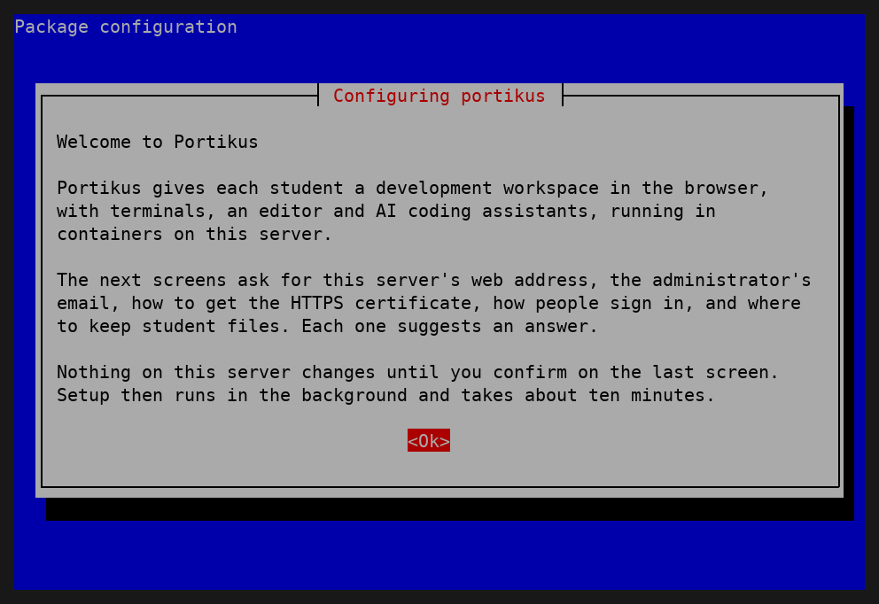
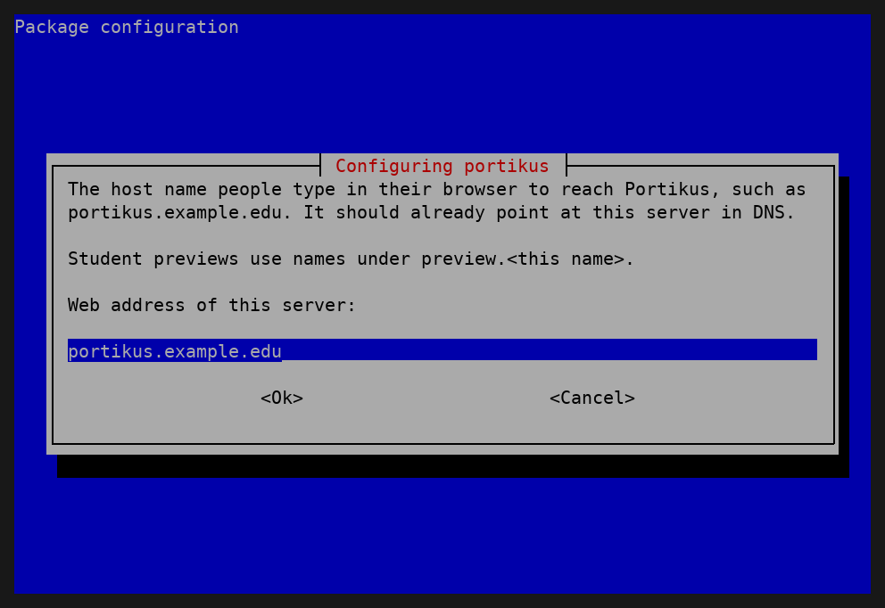
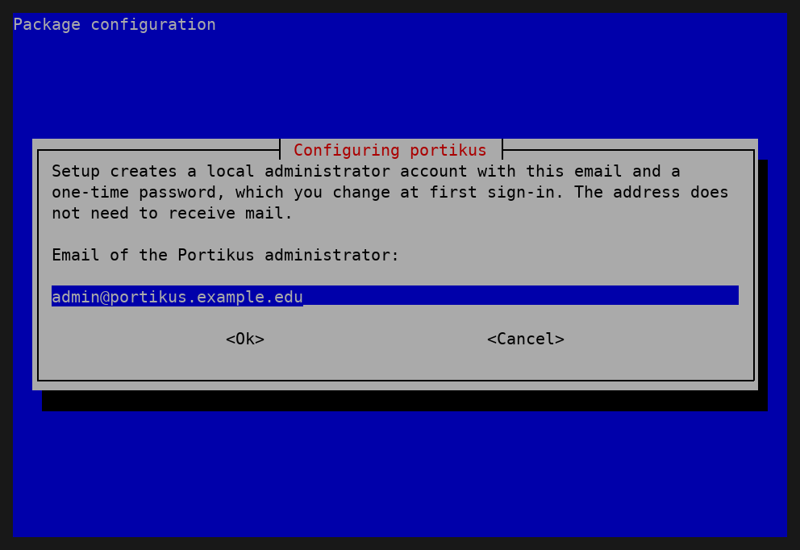
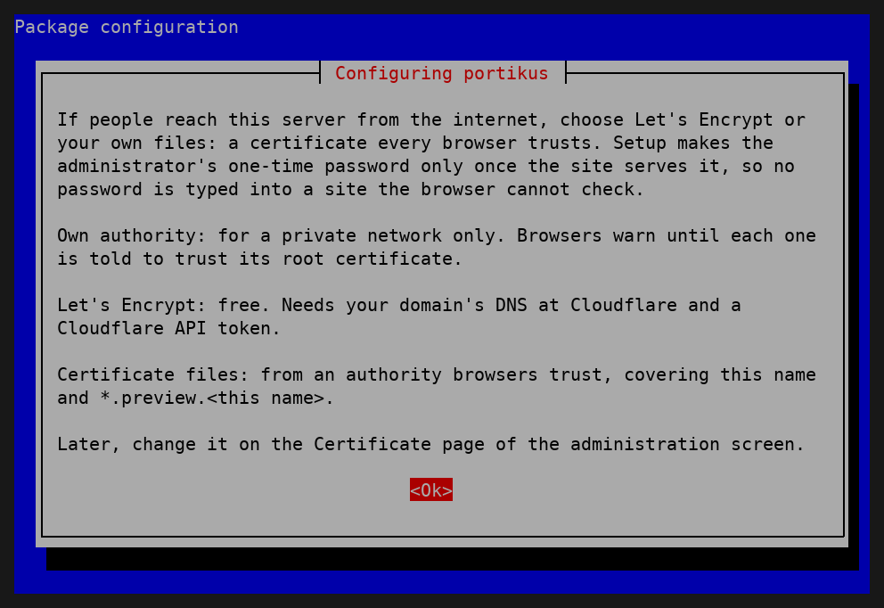
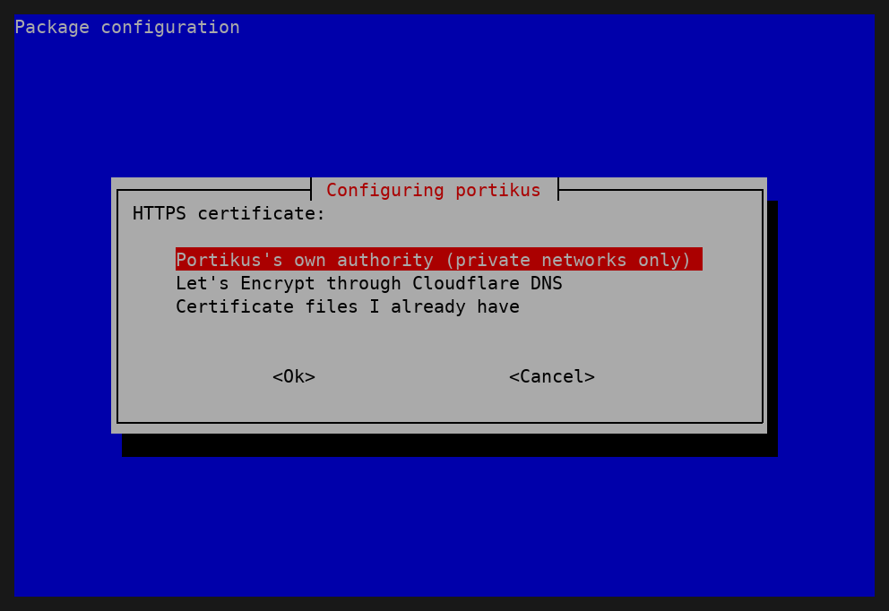
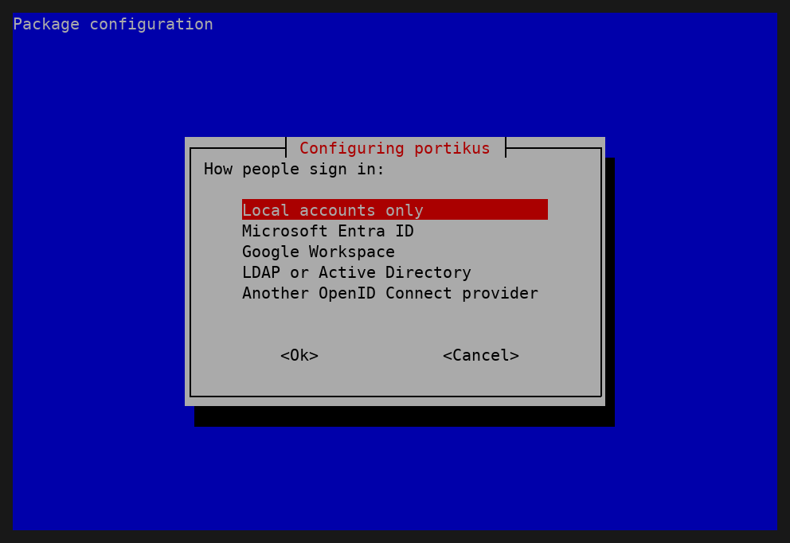
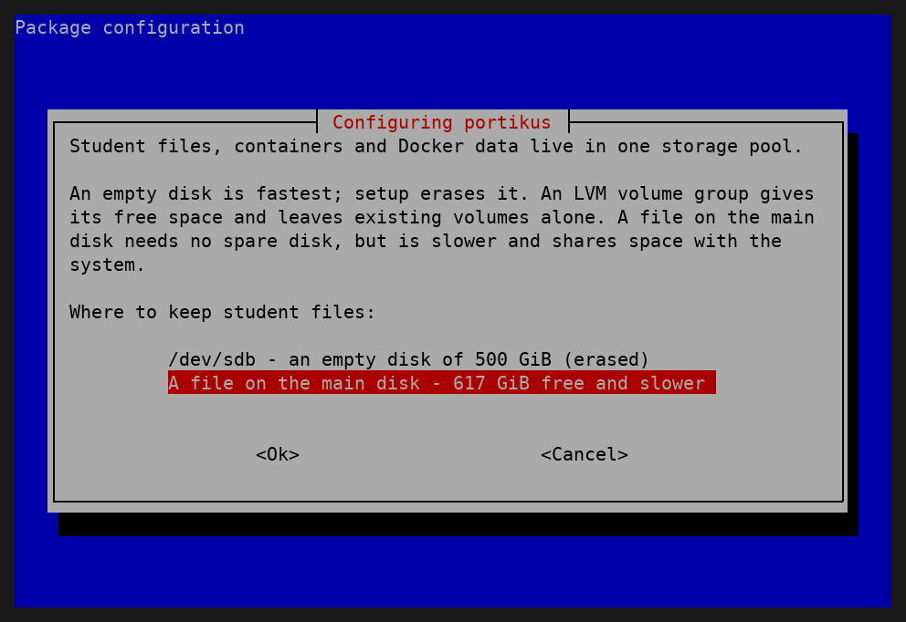
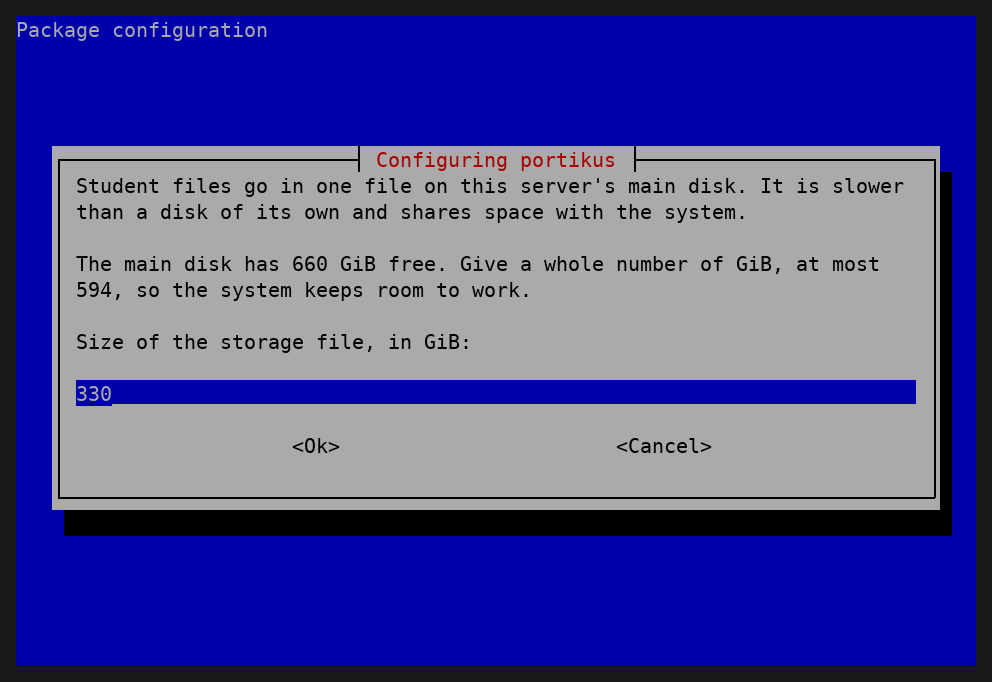
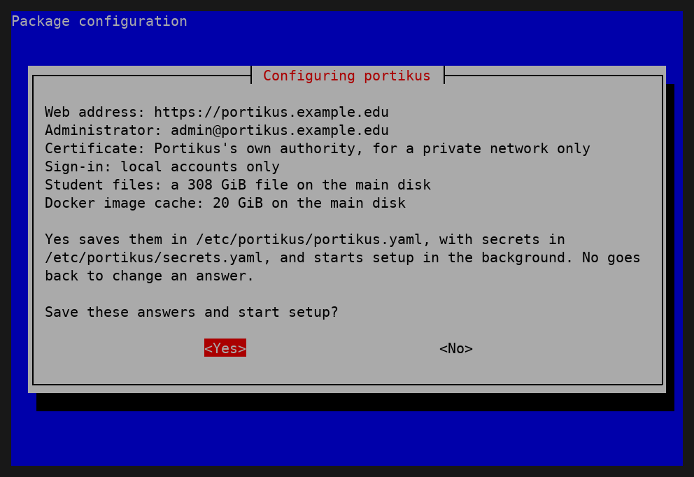
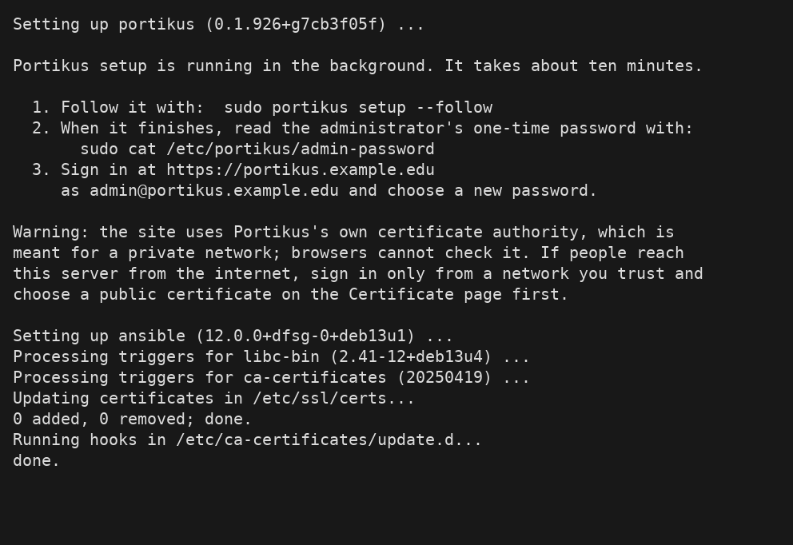

# Installing Portikus

This guide installs Portikus on a Debian 13 x86-64 server: bare metal or a
full virtual machine, rented from any provider or your own hardware. It is
the normal way to install it: put Debian 13 on the server, add the Portikus package
repository, run `apt install portikus`, and answer a short series of text
screens. Setup then runs on its own, and you sign in as the administrator.

The tooling under `infra/` (a libvirt virtual machine built from a
workstation with Ansible) is for development only: the project's pilot and
its rehearsal machine. You do not need it.

Every command below runs on the server as root, or with `sudo` in front, as
shown. The steps were rehearsed on a fresh Debian 13 virtual machine
(`make install-test`, docs/OPERATIONS.md, "The rehearsal VM"). Where a
detail could not be checked that way, this guide says so.

## What you need

- **A server running Debian 13 ("trixie"), x86-64.** It must be a physical
  server or a full virtual machine, not a container-based VPS. It can come
  from any hosting provider or be your own hardware. docs/HOSTING.md says
  what size suits a class of about 24.
- **Storage for student files.** Best is a spare, empty disk that Portikus
  can use whole. An existing LVM volume group with free space also works
  (LVM, the Logical Volume Manager, is Linux's disk-pooling system). When
  the only disk is the system disk, or the disks are mirrored together, use
  a file on the main disk, which needs no spare disk but is slower. "Before
  you install Debian" below says how to plan this.
- **A DNS name you control**, such as `portikus.example.edu`, for the
  server. Students also get preview addresses under `preview.<that name>`.
- **A plan for the HTTPS certificate.** A server people reach from the
  internet needs a certificate every browser trusts before anyone types a
  password into it. The install asks for one: Let's Encrypt through
  Cloudflare's DNS (have a Cloudflare API token ready), or certificate
  files you already have. Portikus's own certificate authority is the
  third choice, for a private network only, since browsers do not trust
  it until told to. Later, an administrator can switch to another ACME
  service (ACME is the protocol these free services speak), one of nine
  DNS providers or port 80, on the **Admin** page, **Certificate** tab
  (docs/ADMIN-GUIDE.md, "The site certificate").
- **Outgoing internet access from the server** during setup (see "Setup").
- **SSH access with a key** to the server as root or as a user with
  `sudo`. Setup turns SSH password sign-in off, so it stops before
  changing anything when neither root nor any member of the `sudo` group
  has a key in `~/.ssh/authorized_keys`.

## Before you install Debian

Install Debian 13 with your provider's installer or from the Debian
installation image. Plan the disks first:

- **With a spare disk**, install Debian on one disk only and leave the
  other completely empty, with no partitions and no software RAID (disk
  mirroring). Portikus then uses the empty disk whole, which is the
  fastest option.
- **With an existing LVM volume group** that has free space, Portikus can
  use that free space and leaves existing volumes alone.
- **With one disk, or with the disks mirrored**, Portikus keeps student
  files in a file on the main disk. Mirroring protects the system and
  student files against one disk failing, at the cost of slower student
  storage and half the total space.

Add your SSH public key during the install. Then sign in over SSH and
check the release:

```
cat /etc/debian_version
```

It should start with `13`. If your provider offers only Debian 12,
install it and upgrade to 13 by following the Debian 13 release notes
("Upgrades from Debian 12 (bookworm)"). Portikus has not been tried on a
server upgraded this way: every rehearsal starts from Debian 13's own
image. Check that `/etc/debian_version` starts with `13` and that
`sudo apt update` shows only `trixie` sources before you go on.

"Example: an OVH dedicated server" at the end of this guide walks through
one provider's steps.

## DNS records

Create these two records at your DNS provider before you install, both
pointing at the server's public IPv4 address (your provider's control
panel shows it):

| Type | Name | Value |
|---|---|---|
| A | `portikus.example.edu` | the server's address |
| A | `*.preview.portikus.example.edu` | the server's address |

Use your own name in place of `portikus.example.edu`. The first record is
the site itself. The second is a wildcard: each running student
application gets its own name under `preview.<site name>`, such as
`alice-5173.preview.portikus.example.edu`, and one wildcard record sends
all of them to the server. If your DNS is at Cloudflare, set both records
to "DNS only" (the grey cloud), not proxied. Cloudflare's free proxy
certificate covers only one level of names below your domain, so it
cannot serve `alice-5173.preview.portikus.example.edu`, and the proxy
would also stand between students and the server's own certificate.
The rehearsals made no public records, so this follows Cloudflare's
documentation rather than a test.

Check the first record from your own computer before going on:

```
host portikus.example.edu
```

## Adding the Portikus package repository

A fresh Debian 13 may lack the two tools this needs, `curl` to download
and `gpg` to check the key, so install them first:

```
sudo apt update
sudo apt install -y curl gpg
```

Then fetch the repository's signing key and check that it is the real
one before trusting it:

```
sudo curl -fsSL -o /usr/share/keyrings/portikus-archive-keyring.gpg https://toddawhittaker.github.io/portikus/apt/portikus-archive-keyring.gpg
test "$(gpg --show-keys --with-colons /usr/share/keyrings/portikus-archive-keyring.gpg | awk -F: '$1=="fpr"{print $10}')" = 9F6FD4CD5CC5C43AB5125705015D38802EF8D0F4 && echo "Key OK"
```

The check prints `Key OK` only when the file holds exactly one key and
its fingerprint is `9F6F D4CD 5CC5 C43A B512 5705 015D 3880 2EF8 D0F4`.
A file with an extra key fails it too. If it does not print `Key OK`,
stop, delete the file with
`sudo rm /usr/share/keyrings/portikus-archive-keyring.gpg`, and report
it: someone may be tampering with your download.

Only after the check passes, tell apt where the repository is and that
only this key may sign it:

```
echo "deb [signed-by=/usr/share/keyrings/portikus-archive-keyring.gpg] https://toddawhittaker.github.io/portikus/apt trixie main" | sudo tee /etc/apt/sources.list.d/portikus.list
```

The package installs the same key at the same path and writes it again
on every upgrade, so apt keeps trusting it across upgrades.

## Installing

```
sudo apt update
sudo apt install portikus
```

apt installs the package and its dependencies from Debian and then shows
the questions described next. Nothing on the server is configured until
you say Yes on the last screen.

## The install screens

The questions appear as grey dialogs on a blue screen. Move with the arrow
keys and Tab, choose with Enter. **Cancel** goes back one screen. A
screen appears only when your earlier answers make it relevant. A hidden
field, such as a token or password, always looks empty when you come back
to it; leave it blank to keep the value you entered. In a small terminal,
such as an 80 by 25 console, a question with a long explanation shows the
explanation on its own screen first; choose Ok to reach the question. If an
answer is not valid, a "Please check that answer" note says why, and the
question comes back:

```
       ┌───────────────────┤ Configuring portikus ├────────────────────┐
       │                                                               │
       │ Please check that answer                                      │
       │                                                               │
       │ A tenant ID looks like 12345678-90ab-cdef-1234-567890abcdef.  │
       │                                                               │
       │                            <Ok>                               │
       └───────────────────────────────────────────────────────────────┘
```

### 1. Welcome



Says what Portikus is and what will be asked. Choose Ok.

### 2. Web address of this server



The DNS name from "DNS records", such as `portikus.example.edu`. The
suggestion is the server's own full host name, which on a rented server is
usually the provider's name for it, so replace it. When the server's host
name has no dot, the field starts empty. Use lower-case letters, digits,
hyphens and dots.

### 3. Email of the Portikus administrator



Setup creates one local administrator account with this email. It is the
name you sign in with, and it does not need to receive mail. The
suggestion is `admin@<web address>`, which is fine.

### 4. HTTPS certificate





If people reach the server from the internet, choose **Let's Encrypt
through Cloudflare DNS** or **Certificate files I already have**:

- **Let's Encrypt** asks for an email that Let's Encrypt writes to about
  expiry, then a Cloudflare API token with the "Edit zone DNS" permission
  for your domain. Let's Encrypt proves you control the domain through a
  DNS record, which is the only way it issues the wildcard certificate
  student previews need, so the domain's DNS must be at Cloudflare.
- **Certificate files** asks for the full paths of a certificate and its
  private key on this server, in PEM format. They must come from an
  authority browsers trust and cover both the web address and
  `*.preview.<web address>`.

With either one, setup does not make the administrator's one-time
password until the site serves that certificate ("Setup", below). No
password is ever typed into a site the browser cannot check.

**Portikus's own authority** (the suggestion) is for a private network,
such as a lab. Browsers warn until each one is told to trust its root
certificate ("After setup", below), and setup prints a warning that says
so.

Setup refuses Portikus's own authority when the web address resolves in
DNS to a public address. If you really want it there, for example for a
short test, add this line to `/etc/portikus/portikus.yaml` and run
`sudo portikus setup` again:

```yaml
portikus_allow_internal_ca_on_public_address: true
```

While it is in use on a public address, administrators get an alert and
the Certificate tab shows a warning. The other ways out are to pick Let's
Encrypt or your own files with `sudo dpkg-reconfigure portikus`, or to
run `sudo portikus reset-certificate`, which always works.

### 5. How people sign in



Portikus always has local accounts, which the administrator creates. This
screen adds your institution's accounts on top:

- **Local accounts only** (the default): nothing more to answer. You can
  add single sign-on later with `sudo dpkg-reconfigure portikus`.
- **Microsoft Entra ID**: asks the tenant ID, the client ID and the client
  secret.
- **Google Workspace**: asks the allowed domains (separated by spaces), the
  client ID and the client secret.
- **LDAP or Active Directory**: asks the directory server, the kind of
  directory, the directory servers' addresses, the service account and
  its password, where people are, a filter naming who may sign in, and
  optionally where groups are and the directory's CA certificate. With a
  group location it also asks the three group names. The filter decides
  who may sign in at all; the groups only decide the role, and someone
  the filter lets in who is in none of the groups signs in as a student.
  Give each group's short name (its cn), such as `portikus-students`, not
  its full distinguished name (DN).
- **Another OpenID Connect provider** (such as Okta, Keycloak or
  Shibboleth): asks the issuer URL, the client ID and secret, the groups
  claim, and the students', instructors' and administrators' group names,
  as the provider sends them in the groups claim. Only members of one of
  the three groups may sign in.

For Entra, Google and other OpenID Connect providers, register Portikus
with the provider first. The client ID screen shows the redirect address
to register, `https://<web address>/dex/callback`. docs/OPERATIONS.md,
"Sign-in providers", has the steps for each provider. If you are not
ready, choose Local accounts only now and add the provider later.

### 6. Where to keep student files

Lists what this server has: each empty disk, each LVM volume group with
free space, and a file on the main disk. The suggestion is always the
file, because choosing a disk erases it.



If you left a spare disk empty, choose that disk. If the disks are
mirrored or there is only one, choose the file.

- **A disk** is followed by **Erase /dev/...?** Choose Yes only if the
  disk holds nothing you need. If you choose No, the answers are saved but
  setup does not start until you say Yes (see "Changing your answers").
- **The file** is followed by **Size of the storage file, in GiB**. The
  suggestion is half the free space on the main disk; the most it accepts
  leaves 10 GiB or a tenth of the free space, whichever is more, for the
  system. About 1,000 GiB suits a class of about 24 (docs/OPERATIONS.md,
  "Host hardware for a class of about 24").



### 7. Save these answers and start setup?

A summary of every answer except secrets:



Yes saves the answers and starts setup. No returns to the web address
question with every answer kept, so you can press Enter through the
screens and change only what you need. Leave hidden fields blank to keep
their values.

## Setup

When the answers are complete, apt finishes and prints:

```
Portikus setup is running in the background. It takes about ten minutes.

  1. Follow it with:  sudo portikus setup --follow
  2. When it finishes, read the administrator's one-time password with:
       sudo cat /etc/portikus/admin-password
  3. Sign in at https://portikus.example.edu
     as admin@portikus.example.edu and choose a new password.
```



With Let's Encrypt or certificate files it adds that the password is
written only once the site serves its public certificate. With Portikus's
own authority it adds a warning that the site is meant for a private
network.

If instead it says "Portikus is installed, but setup has not started", it
lists what is missing; run `sudo dpkg-reconfigure portikus` to answer it.

Setup runs as a background service, `portikus-setup.service`, so it keeps
going if your SSH session drops. `sudo portikus setup --follow` shows its
log as it runs and returns when setup ends. It exits with status 0 when
setup succeeded; when setup failed it says so, with how to read the log
and rerun it with `sudo portikus setup`. Pressing Ctrl-C only stops the
watching, not setup.

In rehearsal on a fresh Debian 13 machine with 12 processor cores, setup
took six to seven minutes; allow up to fifteen on a slower machine or network
(docs/OPERATIONS.md, "The rehearsal VM"). It uses
the Ansible roles shipped in the package to set up, on this server: the
nftables firewall, the student storage pool, Incus (the container system
that runs each student's workspace) and its network, PostgreSQL, Caddy
(the web server that holds the HTTPS certificate), the egress proxy that
controls what workspaces reach on the internet, Dex (the sign-in service),
the workspace image, the Portikus services, and finally the local
administrator.

Setup needs outgoing internet access to:

- Debian's own mirrors;
- Zabbly (`pkgs.zabbly.com`), for Incus;
- GitHub (`github.com` and its release downloads), for Dex's source and
  the workspace image;
- the Go module proxy (`proxy.golang.org`), to build Dex;

The firewall setup installs allows SSH, HTTP (port 80) and HTTPS (port
443) in, and nothing else. For SSH it opens whichever ports the SSH server
itself reports through `sshd -T`, so a server that runs SSH on a port
other than 22 keeps its connection. Port 80 redirects browsers to HTTPS, and it also answers the HTTP-01
check if you later choose that way of getting a certificate.

Setup also hardens the server. SSH accepts keys only, allows root to sign
in only with a key, and gives each connection three tries and 30 seconds.
The firewall drops a source address that opens more than 30 new SSH
connections a minute, and refuses more than 8192 open web connections
from one address. Kernel settings in `/etc/sysctl.d/90-portikus-hardening.conf`
hide kernel addresses and the kernel log and close off features students'
code has no need for. To prove from outside that only SSH, HTTP and HTTPS
answer, run `make external-port-check HOST=<your server>` from a checkout of
the Portikus repository on another machine; with nmap installed and run
as root it checks UDP too.

## First sign-in

With Let's Encrypt or certificate files, setup makes the local
administrator only once the site serves a certificate that browsers
trust. Setup waits up to five minutes for Let's Encrypt. If the
certificate is not served by the end of setup, setup says so and leaves
`/etc/portikus/admin-password` unwritten. The hourly certificate check
makes the administrator as soon as the certificate is served; run
`sudo systemctl start portikus-certificate-check.service` to check at
once, and `sudo portikus status` to see whether the administrator still
waits. Until then the certificate answers can still be changed with
`sudo dpkg-reconfigure portikus`, for example to fix a wrong Cloudflare
token, and setup uses the new answers.

1. Read the one-time password:

   ```
   sudo cat /etc/portikus/admin-password
   ```

2. Open `https://<web address>` in a browser. On the sign-in page, choose
   "Log in with Email" and sign in with the administrator's email and that
   password.
3. Portikus shows only **Set a new password** until you choose one. Once
   you have, the one-time password stops working, and the next setup run
   deletes the file.

If the file is gone or the password is lost, `sudo portikus reset-admin`
makes a new one (docs/OPERATIONS.md, "The local administrator").

## After setup

- **Sign-in provider.** If you chose Local accounts only and want your
  institution's accounts, register Portikus with the provider
  (docs/OPERATIONS.md, "Sign-in providers") and run
  `sudo dpkg-reconfigure portikus`. Otherwise create accounts in the
  Users view (docs/ADMIN-GUIDE.md).
- **Backups.** The server backs itself up every night at 02:30 and keeps
  the encrypted sets in `/var/backups/portikus/local/`. Before students
  store work, sign in, open **Admin**, then **Backups**, and choose
  **Download backup key**. Store the file somewhere other than this
  server, such as a password manager. Then set up a copy of the sets to
  another machine ("Backups: copying them off the server", below). The
  sets on the server alone do not survive losing the server.
- **The certificate.** To change it, sign in, open **Admin**, then
  **Certificate**, and choose Let's Encrypt, another ACME service or your
  own files (docs/ADMIN-GUIDE.md, "The site certificate"). When it is
  applied, the server needs outgoing access to the ACME service and, for
  DNS-01, the DNS provider's API. Prefer the DNS-01 wildcard. With
  HTTP-01 there is no wildcard, so each preview host name gets its own
  certificate, and every certificate is published in public certificate
  logs, where anyone can read the preview names. With Portikus's own authority, for a lab
  or a private network, each browser must trust its root certificate.
  Download it from the same tab and import it into the browser's or the
  system's trusted authorities (infra/README.md, "Browser access", has the
  per-system steps). If you chose it for a server people reach from the
  internet, sign in only from a network you trust and switch to a public
  certificate before anyone else signs in.
- **Alerts.** Portikus can send warnings and failures that need a
  person, and a control-plane service dying, to email, Pushover, ntfy,
  Microsoft Teams or a webhook such as a Slack incoming webhook. Set them
  on the admin page: open **Admin**, then **Settings**, then
  **Notifications**. Email needs an SMTP server on port 587 or 465 with
  TLS. Every other address must be an `https://` address on port 443;
  webhooks on other ports are refused. Saving lets the server reach
  those hosts through its egress proxy, with no restart. Check each
  channel with its own **Send test** button after saving, or from the
  server with `sudo portikus alert warning "Test" "Sent from the server"`.
  The settings live in `/etc/portikus/notify.json`, which the page owns.

  The older keys in `/etc/portikus/secrets.yaml`
  (`portikus_alert_pushover_user_key`,
  `portikus_alert_pushover_app_token` and `portikus_alert_webhook_url`)
  still work, but only to fill `notify.json` once, when setup runs and
  the file does not exist yet. After that, setup never changes the
  file; change alerts on the page.

  The alert that a service failed runs through the worker's bundled
  Node, so a broken worker install can also stop that alert from being
  sent.
- **The root shell.** The admin page has a **Root shell** tab that opens
  a root shell on the server for any administrator. It is on by
  default, and an upgrade turns it on for an existing site. Nothing
  typed is recorded; each shell's opening and closing is audited. To
  turn it off, add `portikus_root_shell: false` to
  `/etc/portikus/portikus.yaml` and run `sudo portikus setup`; that also
  ends any root shell still running. docs/OPERATIONS.md, "The root
  shell", says more.
- **Once the administrator exists, setup leaves the certificate alone.**
  A later setup run, an upgrade or `sudo dpkg-reconfigure portikus` never
  changes it, even if you give a different answer to the certificate
  question. Change it only on the Certificate tab. If the tab has made the
  site unreachable, run `sudo portikus reset-certificate`
  (docs/OPERATIONS.md, "The site certificate").

## The Docker image cache

Setup asks one more question after storage: **Size of the Docker image
cache, in GiB** (20 by default). Workspaces pull Docker Hub and ghcr.io
images through a cache on this server. It is one file of that size on the
main disk, reserved when it is made. Choose a smaller size with
`sudo dpkg-reconfigure portikus`; a new size empties the cache. If the size
would leave less than 10 GiB free, setup makes the cache as large as it can
and says so, or turns it off when not even 1 GiB fits; setup never fails
for lack of room for the cache.

The ghcr.io cache is on by default. Students build and push images in
GitHub Actions, which pushes to the real ghcr.io with the repository's
`GITHUB_TOKEN` and is not affected. In workspaces they only pull those
images, with no `docker login`. While it is on, inside workspaces:

- `docker push` to ghcr.io does not work. Push from GitHub Actions instead.
- Private ghcr.io images cannot be pulled. Make the package public.
- `docker login ghcr.io` reports success without checking anything.
- Tools other than Docker, such as curl, `gh` and ORAS, get certificate
  errors for ghcr.io.

An administrator turns it off under **Admin**, then **Docker**, by clearing
**Cache ghcr.io images**; each workspace picks up the change at its next
start. docs/ADMIN-GUIDE.md, "Docker images and the pull cache", has a
sample workflow.

Security: for ghcr.io the server makes its own certificate authority,
limited to signing `ghcr.io`, in `/etc/portikus/registry/`. Its key is
readable by root alone. Only Docker inside workspaces trusts it; the
server, browsers and other tools do not.

### What saves disk and what saves bandwidth

The cache saves download bandwidth, pull time and the shared Docker Hub
rate limit, not disk: every student who pulls an image still keeps a full
unpacked copy in their own Docker storage. The first fetch of an image
downloads about twice its size; later pulls download almost nothing
(measured: 88 MB, then 8 KB). Seeds save disk: a seed image is stored once
and shared, copy-on-write, by every workspace made or reset from the seed,
costing a student only what they change (four images of 2.9 GB shared by
30 students, instead of about 87 GB). The admin page's **Image use** report
shows popular pulled images to move into the seed. Existing workspaces take
a new seed only when the student uses Reset Docker. The net disk cost of
the cache is its one capped file.

## Backups: copying them off the server

Setup turns on two timers. `portikus-backup.timer` takes a backup at 02:30
each night. `portikus-backup-channel.timer` runs what the admin page's
**Backups** tab asks for (**Back up now**, deleting an old set, restoring
one workspace) within 30 seconds. Both run on the server as root. A set
holds the database, the sign-in accounts, and every workspace's home and
recovery points, each file encrypted with age, a small file-encryption
tool (docs/adr/0044-backups-on-the-server.md). The newest 14 complete sets
are kept.

**The key.** Setup makes one key pair, in `/etc/portikus-backup/`
(readable only by root). The server encrypts to the public half and
keeps the private half, so the Backups tab can restore with one click.
Anyone who controls the server can read the sets, but they can already
read the live workspaces. The encryption is for copies kept **elsewhere**:
without the key, a copy is unreadable, so it is safe on a second machine,
a USB disk or object storage. Download the key once from the Backups tab
(**Download backup key**; the tab reminds you until you do), and store it
off the server and apart from the copies, for example in a password
manager. Without it, the copies cannot be restored if the server is lost.

**The copy is the real backup.** The sets on the server protect against a
mistake or a broken workspace, not against losing the disk or the server.
Copy them elsewhere regularly, at least weekly. The target never needs the
key and never needs to trust the server. From another Linux machine,
signing in as an account on the server that may run `sudo` without a
password (the sets are readable only by root):

```
rsync -a --rsync-path="sudo rsync" you@portikus.example.edu:/var/backups/portikus/local/ ~/portikus-backups/
```

The server needs the `rsync` package (`sudo apt install rsync`). The same
folder can go to object storage with a tool such as `rclone` or the
provider's own command, for example `rclone copy ~/portikus-backups
remote:portikus-backups`. Copy whole set folders (the ones named like
`20260924T023000Z`). A set with a `FAILED` file is incomplete; keep it,
but restore from a complete one. Without `--delete`, the copy keeps sets
the server has since pruned; remove old ones there when you choose. The copy's
target never needs your backup key, but make it write-protected or
versioned (for example object storage with versioning or object lock),
so that nobody can silently replace a set. Restore refuses a set that
was not made with your key.

**Or let the server push the copy.** The server can copy the newest
complete set to another machine itself, every hour, with rsync over SSH
(Secure Shell). It copies only a set whose MAC (a checksum made with
your key) verifies, and it never sends the key. The server's key can
only add files to the target, never read, change or delete them. The
target removes old copies itself and accepts at most one set a day, so
someone who breaks into the server cannot delete or replace the copies
already there, and its new sets push out the genuine ones only a day at
a time. Each copy already on the target survives until it is at least
KEEP days old (the number given to the target's prune command below).
Choose KEEP to cover how long a break-in could go unnoticed; 30 is a
good start.

On the target machine, which needs the `rsync` package (Debian 12 or
later, or Ubuntu 24.04 or later, for its `rrsync` command), make an
account for the copies and a folder with an `incoming` folder inside,
owned by that account:

```
sudo mkdir -p /srv/portikus-sets/incoming
sudo chown -R backups: /srv/portikus-sets
```

Then add to the server's `/etc/portikus/portikus.yaml`:

```yaml
portikus_backup_offsite: "backups@vault.example.edu:/srv/portikus-sets"
# The contents of the target's /etc/ssh/ssh_host_ed25519_key.pub.
portikus_backup_offsite_host_key: "ssh-ed25519 AAAA... root@vault"
```

Run `sudo portikus setup`. It makes a dedicated SSH key in
`/etc/portikus/backup-offsite/` and prints a line starting
`restrict,command="rrsync -wo`; add that whole line to the target
account's `~/.ssh/authorized_keys`. Print it again at any time with
`sudo /usr/lib/portikus/backup/portikus-backup-offsite public-key`. The
server refuses to copy while its key could open a shell on the target.
Nothing is copied until the host key is set: a key learned on first
contact is not trusted. Optional settings:
`portikus_backup_offsite_port` (22) and
`portikus_backup_offsite_bwlimit_kib`, a speed limit in KiB per second
(10000; 0 for none).

Each set arrives in `incoming`. Copy the server's
`/usr/lib/portikus/backup/portikus-offsite-prune` to the target, for
example to `/usr/local/bin/`, and run it from the target account's
crontab (`crontab -e` as that account):

```
30 * * * * /usr/local/bin/portikus-offsite-prune /srv/portikus-sets 30
```

Each run moves finished sets from `incoming` into `/srv/portikus-sets`,
at most one a day (UTC): the first finished set of a day is kept, and a
later one from the same day is dropped within a day. It never replaces
a set already there, and removes a set only when it is more than 30
days old and 30 newer sets are there. Nothing else in the folder is touched.

If `incoming` grows past twice the disk of a typical kept set (at least
1 GiB) or past ten times its file count (at least 100,000), the next run
empties it and the warning reaches you by cron mail. A big set can take
longer than an hour to arrive, and its upload can stall or start late,
so the newest unfinished set is left alone until it is KEEP days old; a
run warns when it grows past four times a typical kept set. An
unfinished set dated more than a day ahead is dropped.
Until the first set is kept there is nothing to size a set by, so no
set in `incoming` is removed for size, only other files. That only limits
what sits in `incoming` between runs. **Set a filesystem quota on the
target account**, for both disk blocks and files (inodes). It is the
only real limit on a burst within the hour and on kept sets that keep
growing. With quotas enabled on the filesystem (the `quota` package and
the `usrquota` mount option), for example 200 GiB and 2 million files:

```
sudo setquota -u backups 200G 200G 2000000 2000000 /srv
```

Size it to hold KEEP sets plus a few spare. A run that adds a set warns
by cron mail when `quota` shows no disk or no file limit for the account
on that filesystem, or when the `quota` package is not installed. When
you update Portikus, copy `portikus-offsite-prune` to the target again,
since the copy there does not update itself. Watch a server run with
`sudo systemctl start portikus-backup-offsite.service` and `sudo
journalctl -u portikus-backup-offsite.service`; a failed run sends an
alert when alerts are set up. To turn it off, set
`portikus_backup_offsite` to `""` and run setup again. The copies on
the target are the same set folders as above, so bring one back with
the `rsync` command in step 5 below.

## Rebuilding from an off-site backup

When the server is lost, or you move to a new one:

1. Rent a new server and install Debian 13, as at the top of this guide.
2. Add the package repository and run `apt install portikus`. Give the
   **same web address** as before (the sign-in accounts are tied to it).
   Follow setup to the end with `sudo portikus setup --follow`.
3. Sign in as the local administrator with the new one-time password
   (`sudo cat /etc/portikus/admin-password`) and choose a password.
4. Open **Admin**, then **Backups**, and choose **Upload backup key**. Pick
   the key file you saved. Setup made this server a key of its own, so
   the tab asks you to confirm replacing it. It has encrypted nothing you
   need yet, so confirm.
5. Copy the sets back onto the server, into
   `/var/backups/portikus/local/`:

   ```
   rsync -a --exclude REQUESTED --rsync-path="sudo rsync" ~/portikus-backups/2*Z you@portikus.example.edu:/var/backups/portikus/local/
   ```

   The `--exclude REQUESTED` keeps copied sets from counting toward the
   limit of 3 requested backups in 14 days. Name the set folders, as
   `2*Z` does, rather than `~/portikus-backups/` with a trailing slash:
   that form would also give `/var/backups/portikus/local` itself the
   owner and permissions of your copy folder.

   Within a minute the Backups tab lists them.
6. Pick the newest complete set, and first prove the key opens it:

   ```
   sudo portikus restore --check 20260924T023000Z
   ```

7. Restore it:

   ```
   sudo portikus restore 20260924T023000Z
   ```

   This replaces the new server's database with the backup's, including
   the sign-in accounts, and brings back every workspace's home. It works
   only on a server with no workspaces, projects or users besides the
   local administrator, so it can never overwrite a server in use. Every
   restored workspace is left stopped, and everyone signs in again. Your
   old administrator password works again; the new one-time password does
   not. Add `--start-check` to also start one restored workspace and check
   its files from inside it.
8. Check the **Workspaces** tab, then tell the students their workspaces
   are back. They start them as usual.

Docker data inside workspaces is not in a backup; students rebuild it by
running their projects again.

## Unattended installs

For a scripted rebuild, give every answer in advance with a preseed file,
so the install asks nothing. The file
`/usr/share/doc/portikus/preseed.example`, installed with the package,
lists every question, the key it writes and an example answer. Before the
package is installed, use the same file from the Portikus repository on
GitHub, `packaging/debian/preseed.example`. Copy it to the server as
`preseed.txt`, keep the
lines that apply, fill them in, and then:

```
sudo debconf-set-selections preseed.txt
sudo DEBIAN_FRONTEND=noninteractive apt-get install -y portikus
sudo portikus setup --follow
```

The preseed holds secrets in plain text. Portikus removes them from its
answer store once written, but delete your `preseed.txt` yourself. Setup
starts only when every answer it needs is there; for a disk that includes
`portikus/storage_confirm` set to `true`.

The certificate keys in the preseed decide the certificate until the
local administrator is made. Leaving them out gives Portikus's own
certificate authority, for a private network only. A Let's Encrypt
preseed, with an ACME email and a Cloudflare API token, starts the site
on Let's Encrypt through Cloudflare's DNS. Certificate files named in the
preseed are used as they are. With either, the administrator's one-time
password appears only once the site serves that certificate ("First
sign-in"). From then on the Certificate tab owns the certificate.

## Changing your answers

```
sudo dpkg-reconfigure portikus
```

This shows the screens again with your current answers filled in. For a
secret, leave it blank to keep the stored one. Saying Yes on the summary
saves and starts setup again, which changes only what differs.

The answers live in `/etc/portikus/portikus.yaml` (secrets in
`/etc/portikus/secrets.yaml`). You may edit the file by hand; a hand edit
wins over the remembered answer the next time you reconfigure, though
comments in it are not kept. If a file holds only a `{}` line, replace
that line with your keys rather than adding them below it. After a hand edit, apply it with:

```
sudo portikus setup
```

This runs setup in the foreground and is safe to run at any time.

A few settings have no screen and are set only in this file. One is
`portikus_public_port`, the port browsers use, which is 443 unless you
add, for example, `portikus_public_port: 8443` for a server whose port
443 belongs to another service. Browsers then need the port in the
address, such as `https://portikus.example.edu:8443`. To set it before
the first setup runs, write the line to `/etc/portikus/portikus.yaml`
before `apt install portikus`.

## Upgrades

```
tmux
sudo apt update
sudo apt upgrade
```

Run upgrades inside `tmux`, above all from the admin page's root shell:
an upgrade restarts the API, which ends every root shell, and dpkg would
be cut off midway without it.

**Upgrading from a release before Epic 35.** Alert webhooks must now be
https URLs on port 443. Releases up to Epic 34 accepted other ports. An
upgrade moves your alert settings into `/etc/portikus/notify.json`
before the services restart. An upgrade that finds a webhook on another
port completes, but warns that alerts are off. Setup then stops until
you correct or remove `portikus_alert_webhook_url` in
`/etc/portikus/secrets.yaml` and run `sudo portikus setup`. The upgrade
also turns the root shell on; see "Alerts" and "The root shell" above.

An upgrade installs the new Portikus release, restarts its services, and
starts setup again in the background, so any change a release makes to the
server is applied too. Follow it with `sudo portikus setup --follow`.

Running workspaces pick up the new release on their own. When the
workspace controller restarts after the upgrade, it restarts the
workspace agent (the small service inside each workspace that the browser
talks to) in every running workspace whose agent is older than the
upgrade. Open terminals and the programs in them keep running, and the
student's page reconnects and shows "Portikus was updated. Your
terminals are still running." Workspaces on an image older than
2026.09.11 are skipped, because restarting their agent would close their
terminals. They keep the old agent until they are next stopped and
started, and each one is named in the controller's log:
`sudo journalctl -u portikus-controller | grep "old workspace agent"`.

## Troubleshooting

- **Is it running?** `sudo portikus status` prints the package version and
  whether setup and each Portikus service is active.
- **Setup failed.** Read the log with `sudo portikus setup --follow` (or
  `sudo journalctl -u portikus-setup.service` to page through it). The
  failed task is marked `fatal:` and says why. Fix the cause, then run
  `sudo portikus setup` to try again in the foreground; it carries on from
  where things stand.
- **Setup did not start because of storage.** If you picked a disk and
  answered No to "Erase ...?", setup will not touch the disk. Run
  `sudo dpkg-reconfigure portikus` and answer Yes, or choose another
  storage option.
- **Certificate failures.** The Certificate tab shows the last error and
  what was checked. Check both DNS records point at the server
  (`host portikus.example.edu` and `host test.preview.portikus.example.edu`)
  and that the DNS provider's token can edit that zone. Let's Encrypt
  limits repeated failures, so fix the cause before retrying many times.
  Caddy's own log is in `sudo journalctl -u caddy`. A site that no
  browser can reach any more is recovered with
  `sudo portikus reset-certificate` (docs/OPERATIONS.md, "The site
  certificate").
- **Setup waits at the start.** Setup waits up to fifteen minutes for
  another apt or dpkg run to finish. Let it finish.
- **Downloads fail.** Check the server reaches the sites listed under
  "Setup".

## If the signing key is ever compromised

The key that signs the repository does not expire. If it were ever stolen,
the project would publish a revocation (the project holds an offline
revocation certificate for this key) and a new key, and announce both on
the project's GitHub page. Until you have imported the new key, apt
refuses updates signed by anyone else, which is the point. When a new key
is announced, fetch it over the same address as above, check its new
fingerprint against the announcement, and run `sudo apt update`. Do not
trust a new key that has not been announced on the project's GitHub page.
Do not rely on an upgrade to bring the new key either. The package writes
its own copy of the key file on every upgrade, and a package signed with a
stolen key could write any key there. Only a key whose fingerprint you
checked against the announcement is safe.

## Example: an OVH dedicated server

One way to get a server: these steps follow OVH's control panel for an
Eco dedicated server, which docs/HOSTING.md recommends. Other providers
differ. The menu names were not checked against a live OVH account; if one
differs, look on the server's page for the action that installs or
reinstalls the operating system.

1. Order the SYS-GAME-2 (docs/HOSTING.md, "Recommendation"). Pick the US
   data centre (Vint Hill, Virginia) if your students are in the US.
2. When the server is delivered, open it in the OVH control panel and
   choose **Install** (or **Reinstall**) to pick an operating system.
3. Choose the **Debian 13** template.
4. Choose how the two NVMe disks are used. You have two good choices:
   - **Keep the second disk out.** Use custom partitioning so Debian is
     installed on the first disk only, with no software RAID (disk
     mirroring), and leave the second disk completely empty: no
     partitions. Portikus then uses the second disk whole, which is the
     fastest option.
   - **Accept OVH's default**, which mirrors both disks (RAID 1) so the
     system survives one disk failing. Portikus then keeps student files
     in a file on the main disk, which is slower and shares space with the
     system.

   On the install screen "Where to keep student files", choose the second
   disk (usually `/dev/nvme1n1`) in the first case and the file in the
   second.

   The trade-off: keeping the second disk out gives students the fastest
   storage and the whole disk, but a failure of the first disk takes the
   system down. The default mirror protects the system and student files
   against one disk failing, at the cost of slower student storage and
   half the total space.
5. Add your SSH public key when the installer asks for one, and start the
   installation. OVH emails you when it is done.
6. Sign in over SSH as the user OVH names in that email (often `debian`),
   and check the release:

   ```
   cat /etc/debian_version
   ```

   It should start with `13`.

If OVH's installer does not offer Debian 13, install Debian 12 and upgrade
it to 13 by following the Debian 13 release notes ("Upgrades from Debian 12
(bookworm)"). Portikus has not been tried on a server upgraded this way
(see "Before you install Debian").
