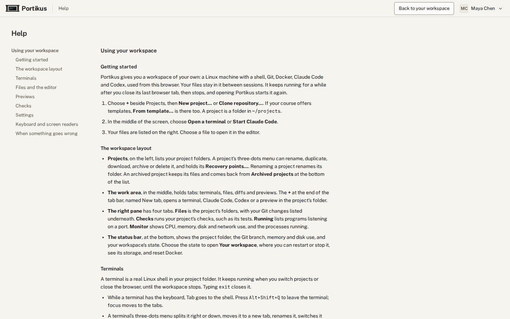
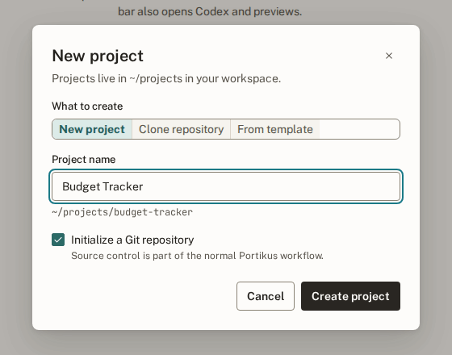
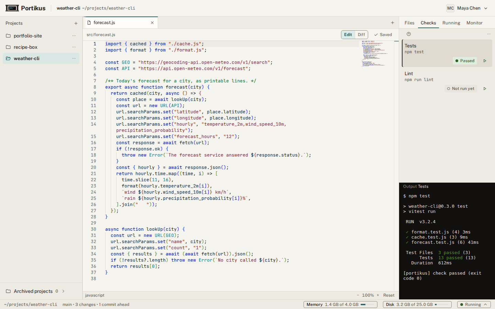
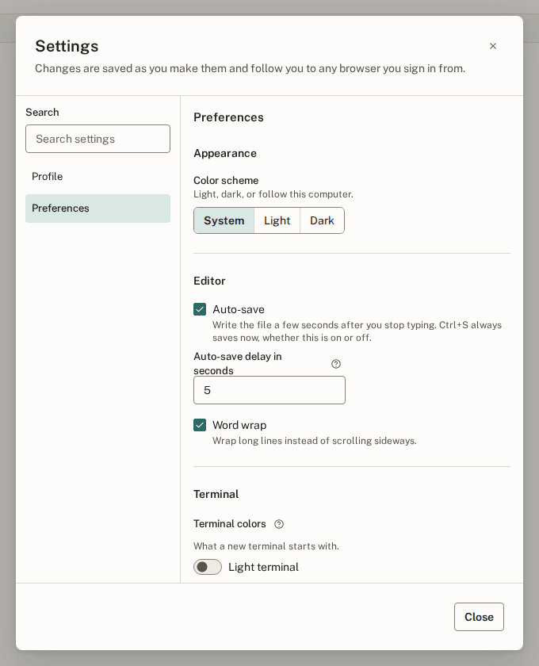
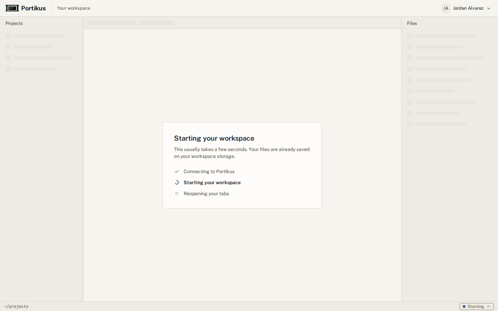
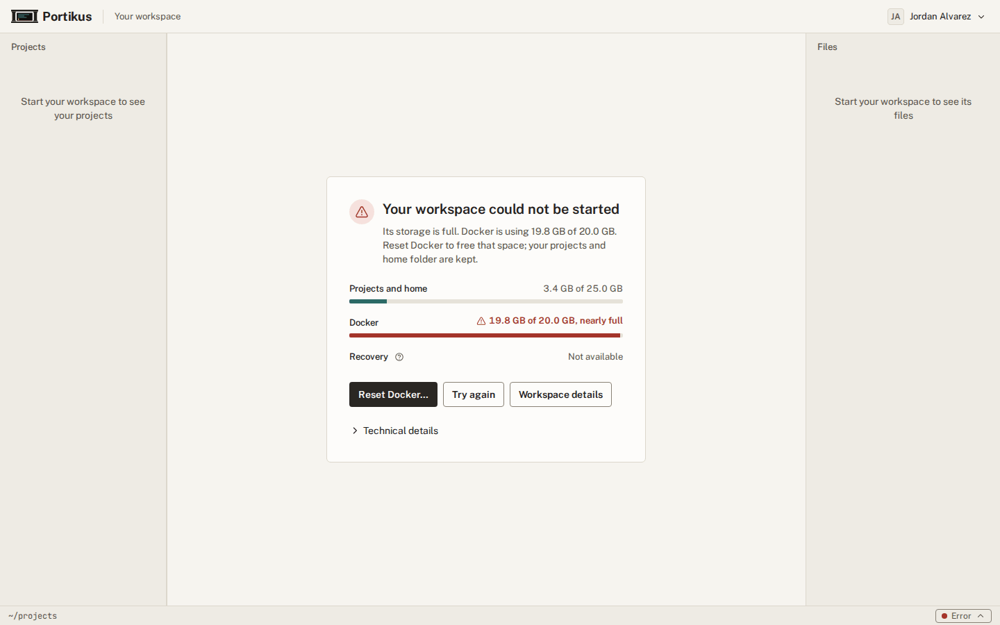

# Student guide

This guide is for students who use Portikus in a course. It covers the
everyday tasks: starting a project, working in terminals and the editor,
previewing a web app, running checks, and what to do when something goes
wrong.

Portikus has the same help built in. Choose your name at the top right and
then **Help**; it opens in a new tab. Many screens also have a small **?**
button beside a label. Choose it to read one or two sentences about that
item, and press Escape to close it.



## Getting started

Portikus gives you a workspace of your own: a Linux machine with a shell,
Git, Docker, Claude Code and Codex, used from your web browser. Your files
stay in it between sessions. The workspace keeps running for a while after
you close its last browser tab, then stops. Opening Portikus starts it
again.


To start working:

1. Choose **+** beside Projects, then **New project…** or **Clone
   repository…**. If your course offers templates, **From template…** is
   there too. A project is a folder in `~/projects`.
2. In the middle of the screen, choose **Open a terminal** or **Start Claude
   Code**.
3. Your files are listed on the right. Choose a file to open it in the
   editor.



## The workspace layout

- **Projects**, on the left, lists your project folders. A project's
  three-dots menu can rename, duplicate, download, archive or delete it, and
  holds its **Recovery points…**. Renaming a project renames its folder. An
  archived project keeps its files and comes back from **Archived
  projects** at the bottom of the list.
- **The work area**, in the middle, holds tabs: terminals, files, diffs and
  previews. The **+** at the end of the tab bar, named New tab, opens a
  terminal, Claude Code, Codex or a preview in the project's folder.
- **The right pane** has four tabs. **Files** shows the project's folders,
  with your Git changes listed underneath. **Checks** runs your project's
  checks, such as its tests. **Running** lists programs listening on a
  port. **Monitor** shows CPU, memory, disk and network use, and the
  processes running.
- **The status bar**, at the bottom, shows the project folder, the Git
  branch, memory and disk use, and your workspace's state. Choose the state
  to open **Your workspace**, where you can restart or stop it, see its
  storage, and reset Docker.

## Keep your workspace running while you are away

To leave a coding agent working while you are away, open **Your
workspace** from the status bar. Under **Keep running**, pick how long in
**Keep running for**, up to the limit your administrator set, then press
**Keep running until …**, which shows the end time. Until then, closing
the page or leaving it idle does not stop the workspace. The status bar
shows "Kept running until" and the end time; a hold ending six or more
days ahead shows its date as well. To change it, pick another length and
press the button again. To let the workspace stop as usual again, press
**Don't keep running**. Afterwards the workspace stops as usual, with the
"Still working?" warning first. If your administrator has turned the
feature off, the section is not shown.

## Terminals

A terminal is a real Linux shell in your project folder. It keeps running
when you switch projects or close the browser, until the workspace stops.
Typing `exit` closes it.

- While a terminal has the keyboard, the Tab key goes to the shell. Press
  **Alt+Shift+Q** to leave the terminal; focus moves to the tabs.
- A terminal's three-dots menu splits it right or down, moves it to a new
  tab, renames it, switches it between light and dark, or closes it. The
  picture at the top of this guide shows one tab split into two terminals.
- After the workspace stops or restarts, an old terminal says it ended.
  Choose **New terminal here** to open a fresh one in its place.

## Files and the editor


- Choose a file in Files, or press Enter on it, to open it. The editor saves
  a few seconds after you stop typing. You can change the delay, or turn
  auto-save off, in Settings. **Ctrl+S** saves at once.
- A Markdown file shows a preview beside the source.
- A letter beside a file shows its Git state: **M** modified, **A** added,
  **D** deleted, **R** renamed, **?** new and not yet tracked, **!** in
  conflict. **Diff** shows what changed since your last commit.
- Right-click a file, or press **Shift+F10**, for new file, new folder,
  rename, move, download, upload and delete.
- **Find in files** is the magnifier at the top of Files.

## Previews

When your web app is listening on a port, it appears under **Running**.


- **Preview** opens the app in a tab inside Portikus. The button beside it
  opens it in a new browser tab.
- Only you can open your previews, after signing in. There are no public
  links.
- If Vite or webpack-dev-server refuses the preview host, the preview shows
  one line to add to its config file. Add it, restart the server, then
  choose **Retry**.
- Ports below 1024 cannot be previewed, and neither can a few reserved ones
  such as SSH, Docker and PostgreSQL. Run your web app on a port from 1024
  up, such as 3000 or 5173, then choose **Choose another port…** in the
  preview.

## Container images with GitHub Actions

Build and push your own images from GitHub Actions, then pull them in your
workspace. Actions runs on GitHub's machines and pushes to ghcr.io with the
repository's built-in `GITHUB_TOKEN`, so no password is needed. Put this in
`.github/workflows/image.yml` (the repository name in the tag must be
lowercase):

```yaml
name: image
on: push
jobs:
  build:
    runs-on: ubuntu-latest
    permissions:
      contents: read
      packages: write
    steps:
      - uses: actions/checkout@v4
      - uses: docker/login-action@v3
        with:
          registry: ghcr.io
          username: ${{ github.actor }}
          password: ${{ secrets.GITHUB_TOKEN }}
      - uses: docker/build-push-action@v6
        with:
          push: true
          tags: ghcr.io/${{ github.repository }}:latest
```

After the first run, open the package on GitHub (your profile, then
**Packages**), and under **Package settings** make it public. Then, in a
terminal in your workspace, run `docker pull ghcr.io/<owner>/<image>:<tag>`,
or start a Dockerfile with `FROM ghcr.io/<owner>/<image>:<tag>`. No
`docker login` is needed.

Portikus caches ghcr.io unless your administrator turned that off. While it
does, inside your workspace:

- `docker push` to ghcr.io does not work. Push from GitHub Actions instead.
- Private ghcr.io images cannot be pulled. Make the package public.
- `docker login ghcr.io` reports success without checking anything.
- Tools other than Docker, such as curl, `gh` and ORAS, get certificate
  errors for ghcr.io.

## Checks

Checks are commands your project lists in `.portikus/checks.json`, such as
`npm test`. Open **Checks** and press the run button beside one to see its
real output. The three-dots button, **Edit checks**, changes the list.



## Settings

Open **Settings** from the menu under your name. Your settings follow you to
any browser you sign in from.

- **Profile** shows what your institution's sign-in provides, and lets you
  add a picture and links.
- **Preferences** covers the color scheme, editor auto-save and word wrap,
  terminal colors, screen reader mode and your workspace's timezone.
- **Password** appears when your account has a Portikus password, and
  changes it.



## Keyboard and screen readers

These keys are hard to discover:

| Keys | What they do |
|---|---|
| Alt+Shift+Q | Leave a terminal. While a terminal has the keyboard, Tab goes to the shell. Each terminal's three-dots menu also has Leave terminal. |
| Ctrl+M, or Ctrl+Shift+M on a Mac | In the editor, switch whether Tab types a tab or moves focus out of the editor. |
| Alt+Shift+Left Arrow, Alt+Shift+Right Arrow | Move the focused tab left or right. Delete closes it. |
| Shift+F10 | Open the menu of the focused row in the file tree. The Menu key does the same. |
| F8 | Move to notifications. Inside the editor F8 goes to the next problem instead, so leave the editor first. |

What the terminal and editor cannot do:

- Terminals are silent to a screen reader until you turn on Screen reader
  mode in Preferences. With it on, output is read as plain lines of text:
  colors, bold, and layout are not announced.
- With Screen reader mode on, a terminal takes only typed keys. Text from an
  emoji picker, dictation, or some on-screen keyboards is dropped.
- Full-screen programs such as vim, htop, and agent command lines redraw the
  whole screen, so a screen reader may read repeated or partial lines. There
  is no way to review what they draw other than moving through the lines.
- The editor reads the current line. Error underlines, the diff view, and
  inline hints are drawn visually and are not read out. F1 opens the
  editor's command list.

## When something goes wrong



- **Starting your workspace** usually takes a few seconds. Your files are
  already saved.
- **Waiting for room for your workspace** means the server has no room for
  a new workspace yet, and administrators have been told. Leave the page
  open or come back later.
- **Your workspace could not be started**: read the sentence under the
  heading, which says why. If Docker's storage is full, **Reset Docker…**
  frees it and keeps your projects and home folder.
- **You're disconnected from your workspace**: Portikus is trying to
  reconnect. If no window reconnects before the time shown, the workspace
  stops. Your files are saved, but running terminals and previews end.
  Choose **Reconnect now** to try at once.
- **Still working?** You have not typed or clicked in Portikus for a while,
  so the workspace will stop soon. Programs running on their own do not
  count. Choose **Keep working**, or press any key, to keep it running.
- **Your workspace has been slowed down**: it kept its CPUs busy for a long
  time. The notice says how it gets back to full speed. Stop a program you
  do not need from Monitor.
- **Your workspace has been near its memory limit**: if it runs out, the
  biggest program is stopped. Stop a program you do not need from Monitor.
- **You deleted or broke something**: open the project's three-dots menu
  and choose **Recovery points…**. Restoring one puts back every file in the
  folder, Git's own records included, so commits made since then leave the
  folder too. Portikus saves the current state as a new recovery point
  first, so you can go back. It never makes a Git commit for you.
- **Your session ended**: sign in again. Your projects are where you left
  them.
- **Something else**: every message that pops up is kept in
  **Notifications**, in the menu under your name. Read it again there, then
  tell your instructor what it said.


